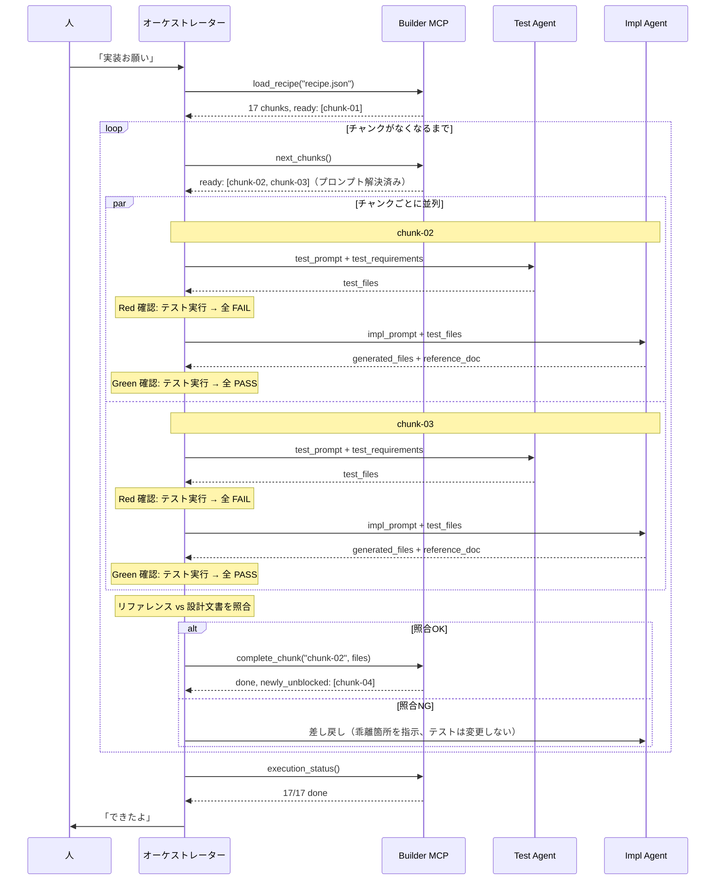
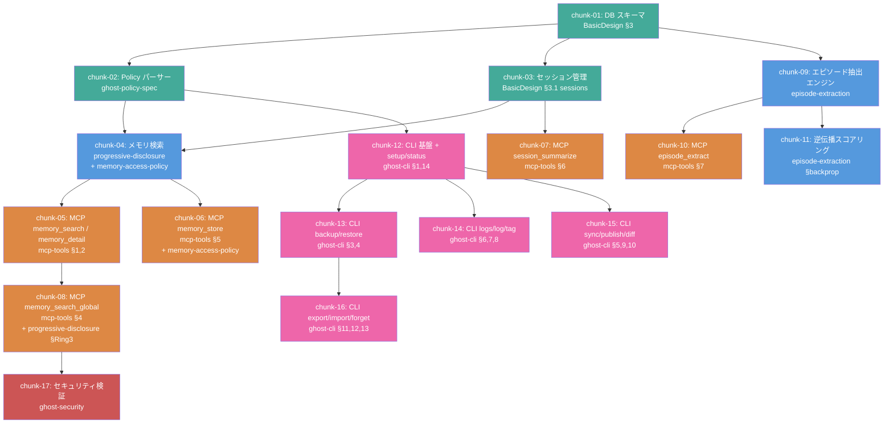

# CDD-Builder 設計書

## 1. 概要

CDD-Builder は、完成した設計文書群を読み取り、LLM が実装可能な粒度に分割し、自律的に実行する MCP サーバー。
CDD（Chat/Character/Chart Driven Development）の「設計は精密に、実装はシンプルに」という開発思想を実現するための **設計→実装の自動翻訳・実行エンジン**。

### 解決する問題

設計文書を LLM に一括で渡すと:
- コンテキストウィンドウを圧迫し、後半で精度が落ちる
- 文書間の暗黙的依存を見落とす
- 実装順序を誤り、手戻りが発生する

### 位置づけ

```
人 + Claude: 楽しくおしゃべりしながら設計
                ↓
        【CDD-Planner】壁打ち・設計支援
                ↓
          設計文書群（完成品）
                ↓
        【CDD-Builder】
          ├── レシピエンジン: 設計を分析・分割・レシピ化
          └── 実行エンジン: レシピを読み、実行アダプタ経由で実装
                ↓
          実装コード（テスト済み）
```

**人は設計に集中し、実装は Builder が自動で回す。**
人は途中で口を挟んでもいいし、完全に任せてもいい。

### 設計品質とコード品質の関係

Planner で十分に壁打ちした後に Builder へ渡すと、可読性の高いアウトプットが得られる。

Builder が生成するコードの品質は、入力となる設計文書の品質に直結する。
型定義・処理ステップ・モジュール間の接続が設計で決まっていれば、Builder は「仕様を翻訳する」だけでよく、判断の余地が減る。結果として：

- 命名が一貫する（設計用語がそのままコードに降りてくる）
- テスト名が設計意図を反映する（仕様文 → テストケース名の直訳）
- 過剰な抽象化が起きない（何を作るか明確なので、「念のため」のコードが不要）
- モジュール分割が自然になる（設計のレイヤー構造がそのままディレクトリ構成に反映される）

これは Vibe コーディング（曖昧な指示で AI に一任する方式）との決定的な違いであり、CDD の「設計は精密に、実装はシンプルに」が実際のコードに現れる部分でもある。

---

## 2. アーキテクチャ

```
Builder
├── レシピエンジン（設計 → レシピ変換）
│   ├── analyze_design   … 設計文書群の構造分析
│   ├── split_chunks     … 実装チャンクへの分割
│   ├── validate_refs    … 参照整合性チェック
│   └── export_recipe    … レシピファイル出力
│
├── 実行エンジン（レシピ → 実装コード）
│   ├── load_recipe      … レシピ読み込み・実行状態初期化
│   ├── next_chunks      … 次の実行可能チャンクを返す
│   ├── complete_chunk   … チャンク完了の検証・記録
│   └── execution_status … 全体進捗の可視化
│
└── 実行アダプタ（差し替え可能）
    ├── claude-code      … Claude Code の Task エージェント（デフォルト）
    ├── local-llm        … Ollama, llama.cpp 等
    └── (将来)           … 任意の LLM / エージェント
```

### 設計原則

- **レシピエンジンは LLM に依存しない。** 純粋に「何を、どの順で、どこまでやるか」を管理する
- **実行アダプタは差し替え可能。** インターフェースだけ決め、実装は自由
- **実装プロンプトは素の自然言語。** 特定の API 形式に依存しない。Claude でもローカル LLM でも読める

---

## 3. MCP ツール仕様 — レシピエンジン

### 3.1 `analyze_design`

設計文書群を読み取り、構造を分析する。

**入力:**
```json
{
  "doc_paths": ["path/to/BasicDesign.md", "path/to/mcp-tools.md", "..."],
  "project_name": "AI-Ghost-Shell",
  "project_dir": "path/to/Documents/AI-Ghost-Shell/"
}
```

`project_dir` を指定すると、ディレクトリ内の `decisions.jsonl` も自動で読み込む。

**処理:**
1. **ドリフト検出（既存実装がある場合）**
   - `project_dir` 内に既存のリファレンス（`docs/ref/*.md`）があるか確認
   - リファレンスがあれば、リファレンス生成日時以降の git コミット履歴を取得
   - コミットで変更されたファイルと、リファレンスが記述する機能範囲を照合
   - 乖離があれば `drift_warnings` として警告を出力（処理は止めない）
2. 各文書を読み取り、メタデータを抽出（行数、セクション構成）
3. Planner が付与したフロントマター（`status`, `layer`, `decisions`, `open_questions`）があれば優先使用。なければ本文から推定
4. Markdown リンク（`[表示名](ファイル名.md)`） やセクション参照から文書間の依存グラフを構築
5. `decisions.jsonl` があれば、決定事項と影響文書の関係を依存グラフに反映
6. 各文書をレイヤーに分類
7. 技術選定に関する記述を設計文書から抽出（→ recipe.json の `tech_stack` に反映）
8. 推定トークン数を算出

**ドリフト検出の出力例:**

乖離が見つかった場合、出力に `drift_warnings` が含まれる:
```json
{
  "drift_warnings": [
    {
      "reference": "docs/ref/chunk-01-db-schema.md",
      "commits_since": 3,
      "changed_files": ["src/db/schema.sql", "src/db/connection.ts"],
      "message": "リファレンス生成後にデータ層のコードが変更されています。設計文書が最新の実装を反映しているか、Planner で確認してください"
    }
  ]
}
```

乖離がない場合、`drift_warnings` は空配列。Builder は警告を出すが処理を止めない。
続行するかどうかの判断は人に委ねる。

**出力:**
```json
{
  "project_name": "AI-Ghost-Shell",
  "drift_warnings": [],
  "documents": [
    {
      "path": "BasicDesign.md",
      "lines": 484,
      "estimated_tokens": 3200,
      "layer": "foundation",
      "sections": ["ER図", "テーブル定義", "エディション構成"],
      "references_to": ["episode-extraction.md", "ghost-policy-spec.md"],
      "referenced_by": ["mcp-tools.md", "ghost-cli.md", "operation-flows.md"]
    }
  ],
  "dependency_graph": { ... },
  "layers": {
    "foundation": ["BasicDesign.md", "memory-access-policy.md", "progressive-disclosure.md"],
    "specification": ["ghost-policy-spec.md", "episode-extraction.md", "ghost-security.md"],
    "usecase": ["ai-ghost-backup-usecases.md", "ai-side-usecases.md"],
    "interface": ["mcp-tools.md", "ghost-cli.md"],
    "execution": ["operation-flows.md", "ベンチマーク_ログ抽出クエリ.md"],
    "context": ["prior-art-comparison.md", "ToDo.md"]
  },
  "total_tokens": 33000
}
```

### 3.2 `split_chunks`

分析結果を元に、実装チャンクに分割する。

**入力:**
```json
{
  "analysis": "（analyze_design の出力）",
  "strategy": "bottom_up",
  "constraints": {
    "max_input_tokens": 8000,
    "max_output_tokens": 12000,
    "max_source_docs": 2,
    "max_output_files": 5
  }
}
```

**分割ロジック:**

```
Step 1: 依存グラフをトポロジカルソート
         → 被依存が多い文書から実装順序を決定

Step 2: 実装レイヤーにマッピング
         設計レイヤー          実装レイヤー
         ──────────          ──────────
         foundation     →    データ層（DB, スキーマ）
         specification  →    ビジネスロジック層
         usecase        →    （実装には直接使わない。検証基準として参照）
         interface      →    API / CLI 層
         execution      →    （テスト・ベンチマーク用）
         context        →    （実装対象外）

Step 3: 各レイヤー内でチャンクに分割
         分割基準:
         - 1チャンク = 1つの凝集した機能単位
         - 参照する設計文書は 1〜2 本
         - 生成するファイルは 3〜5 本
         - 完了条件がテスト可能
```

**出力:**

`split_chunks` は機械的に分割可能な範囲でチャンク候補を生成する。
`expected_outputs` や `completion_criteria` は人がレビューで具体化する前提のため、初期値は汎用的な内容になる。

```json
{
  "chunks": [
    {
      "id": "chunk-01",
      "name": "データベーススキーマ",
      "description": "BasicDesign.md に基づく実装",
      "source_docs": [
        {
          "path": "BasicDesign.md",
          "sections": ["3. ER図", "3.1 テーブル定義"],
          "include": "partial"
        }
      ],
      "expected_outputs": [],
      "completion_criteria": [
        "テストが通る",
        "設計文書の入力パラメータが全てテストされている",
        "エラーケースのテストが1つ以上ある",
        "depends_on チャンクの出力との接続が検証されている"
      ],
      "test_requirements": {
        "interface_tests": [
          "5テーブルが全て作成される",
          "マイグレーションが冪等（2回実行しても壊れない）"
        ],
        "boundary_tests": [
          "DB ファイルが存在しない場合に新規作成される",
          "既存 DB に対するマイグレーション実行"
        ],
        "integration_refs": []
      },
      "implementation_prompt_template": "以下の設計に基づき、データベーススキーマ を実装してください。\n\n{source_content}",
      "reference_doc": "docs/ref/chunk-01-データベーススキーマ.md",
      "depends_on": [],
      "estimated_input_tokens": 2500,
      "estimated_output_tokens": 3750,
      "validation_context": "UC-1: 初期セットアップで ghost.db が作成される"
    },
    {
      "id": "chunk-02",
      "name": "ghost-policy.toml パーサー",
      "depends_on": ["chunk-01"],
      "source_docs": [
        {
          "path": "ghost-policy-spec.md",
          "sections": ["全体"],
          "include": "full"
        }
      ],
      ...
    }
  ],
  "execution_order": [
    ["chunk-01"],
    ["chunk-02", "chunk-03"],
    ["chunk-04"],
    ...
  ],
  "needs_review": true,
  "review_notes": [
    "各チャンクの expected_outputs を設定してください",
    "各チャンクの implementation_prompt_template を具体化してください",
    "各チャンクの completion_criteria を具体化してください"
  ]
}
```

`execution_order` は DAG のレベル順。同一レベルのチャンクは並列実行可能。

`needs_review` は常に `true` を返す。`split_chunks` は機械的に分割するだけで、`expected_outputs` や `completion_criteria` の具体化は人の判断が必要。`review_notes` にレビュー指示が含まれる。

**`test_requirements` の構造:**

設計文書から抽出した「テストすべき観点」を明示する。テスト生成エージェントはこれを仕様として受け取り、テストコードを生成する。

| フィールド | 内容 |
|-----------|------|
| `interface_tests` | 設計文書に記載された入出力パラメータ・公開 API の動作検証 |
| `boundary_tests` | エラーケース・境界値・異常系の検証 |
| `integration_refs` | `depends_on` チャンクとの接続検証（テーブル名・型・インターフェースの一致） |

`test_requirements` は `completion_criteria` と対になる。`completion_criteria` が「何を満たせば完了か」、`test_requirements` が「何をテストすれば検証できるか」を定義する。

**DraftChunk 中間型:**

`split_chunks` の出力チャンクは最終的な `Chunk` ではなく `DraftChunk` 中間型。`export_recipe` が設計文書の内容を埋め込んで `Chunk` に変換する。

```
DraftChunk（split_chunks の出力）
  ├── implementation_prompt_template  … {source_content} プレースホルダを含むテンプレート
  ├── test_requirements               … 設計文書から抽出したテスト観点
  └── source_content なし            … まだ設計文書の内容は埋め込まれていない

        ↓ export_recipe で変換

Chunk（recipe.json の最終形）
  ├── implementation_prompt           … プレースホルダ解決済みの完全なプロンプト
  ├── test_requirements               … そのまま引き継ぎ
  └── source_content                  … 設計文書の該当セクションが埋め込み済み
```

### 3.3 `validate_refs`

設計文書間の参照整合性をチェックする。

**Planner の `check_consistency` との違い:**
- Planner `check_consistency`: 設計フェーズ中の壁打ちで使う。用語の揺れや決定ログとの乖離など、設計内容の品質を検出する
- Builder `validate_refs`: レシピ化の直前に使う。Planner で解消済みの前提で、**チャンク分割に必要な参照の構造的整合性**（リンク切れ、ID欠番、カバレッジ）に絞ってチェックする

**入力:**
```json
{
  "doc_paths": ["..."]
}
```

**チェック項目:**

| チェック | 内容 | v0.1 |
|---------|------|------|
| 未解決参照 | Markdown リンク（`[表示名](ファイル名.md)`） のリンク切れ | 実装済み |
| ユースケース欠番 | UC-1〜13 / AC-1〜7 に抜け漏れがないか | 実装済み |
| セクション参照 | `{ファイル名} §{番号}` 形式の参照先が存在するか | 実装済み |
| テーブル名不一致 | 文書Aの `episode_memories` と文書Bの `episodes` が同じものを指していないか | 未実装 |
| フロー図カバレッジ | operation-flows が主要ユースケースを網羅しているか | 未実装 |
| ポリシー設定漏れ | ghost-policy-spec に記載のキーが他文書で言及されているか | 未実装 |

v0.1 では構造的な参照整合性（リンク切れ、欠番、セクション参照）に絞って実装。
意味的な整合性チェック（テーブル名不一致、カバレッジ、ポリシー漏れ）は将来バージョンで追加予定。

**出力:**
```json
{
  "status": "warn",
  "issues": [
    {
      "severity": "warn",
      "type": "table_name_mismatch",
      "message": "episode-extraction.md L42: 'episodes' → BasicDesign.md では 'episode_memories'",
      "locations": ["episode-extraction.md:42", "BasicDesign.md:128"]
    }
  ]
}
```

### 3.4 `export_recipe`

チャンク群を実行エンジンが読めるレシピファイルとして出力する。

**入力:**
```json
{
  "chunks": "（split_chunks の出力）",
  "output_path": "path/to/recipe.json",
  "include_source_content": true
}
```

**処理:**
- 各チャンクの `source_docs` で参照されるセクションを**実際に抽出**し、レシピに埋め込む
- チャンク単体で実装に必要な情報が揃うようにする（外部参照不要）
- ユースケース文書は `validation_context` として添付（実装指示には使わない、検証用）
- `tech_stack` は `analyze_design` が設計文書から抽出した技術選定情報をそのまま載せる（Planner の `check_readiness` で技術選定済みであることが保証されている）

**出力: recipe.json の構造**
```json
{
  "project": "AI-Ghost-Shell",
  "created_at": "2026-03-02T...",
  "builder_version": "0.1.0",
  "tech_stack": {
    "language": "TypeScript",
    "runtime": "Node.js",
    "db": "SQLite",
    "test": "vitest",
    "platforms": ["linux", "macos"],
    "platform_notes": "Git版はgitコマンド必須。Lite版はSQLiteのみ",
    "directory_structure": "src/ + tests/"
  },
  "chunks": [
    {
      "id": "chunk-01",
      "name": "データベーススキーマ",
      "depends_on": [],
      "source_content": "## 3. ER図\n...(実際の設計文書の該当セクション)...",
      "implementation_prompt": "以下の設計に基づき、SQLite データベースのスキーマとマイグレーションを実装してください。\n\n{source_content}",
      "expected_outputs": ["..."],
      "completion_criteria": ["..."],
      "test_requirements": { "interface_tests": [...], "boundary_tests": [...], "integration_refs": [...] },
      "reference_doc": "docs/ref/chunk-01-db-schema.md",
      "validation_context": "UC-1: 初期セットアップで ghost.db が作成される"
    }
  ],
  "execution_order": [...]
}
```

---

## 4. MCP ツール仕様 — 実行エンジン

### 4.1 `load_recipe`

レシピファイルを読み込み、実行状態を初期化する。

**入力:**
```json
{
  "recipe_path": "path/to/recipe.json"
}
```

**処理:**
1. recipe.json を読み込み、構造を検証
2. 各チャンクの状態を `pending` で初期化
3. 依存グラフから即座に実行可能なチャンクを特定
4. 実行状態ファイルを生成（ファイル名は `{レシピ名}-state.json`。例: `recipe.json` → `recipe-state.json`）

**出力:**
```json
{
  "project": "AI-Ghost-Shell",
  "total_chunks": 17,
  "ready_chunks": ["chunk-01"],
  "execution_state_path": "path/to/recipe-state.json"
}
```

**execution-state.json の構造:**
```json
{
  "recipe_path": "path/to/recipe.json",
  "started_at": "2026-03-03T...",
  "chunks": {
    "chunk-01": { "status": "pending", "started_at": null, "completed_at": null, "outputs": [] },
    "chunk-02": { "status": "pending", "started_at": null, "completed_at": null, "outputs": [] }
  }
}
```

### 4.2 `next_chunks`

依存が解決済みのチャンクを返す。プレースホルダを実際のコードに差し込み済みの、**そのまま実行可能な実装指示**を組み立てる。

**入力:**
```json
{
  "execution_state_path": "path/to/execution-state.json"
}
```

**処理:**
1. 実行状態から `pending` かつ依存が全て `done` のチャンクを抽出
2. 各チャンクの `source_content` 内の `{{file:...}}` プレースホルダを、実際のファイル内容に置換
3. 実装プロンプトを組み立てる

**プレースホルダ解決の例:**
```
chunk-04 の source_content に含まれる:
  {{file:src/db/schema.ts}}
  → chunk-01 で生成された実際の schema.ts の内容に置換

  {{file:src/policy/parser.ts}}
  → chunk-02 で生成された実際の parser.ts の内容に置換
```

**出力:**
```json
{
  "ready": [
    {
      "id": "chunk-02",
      "name": "ghost-policy.toml パーサー",
      "implementation_prompt": "（プレースホルダ解決済みの完全な実装指示）",
      "expected_outputs": ["src/policy/parser.ts", "src/policy/types.ts", "tests/policy/parser.test.ts"],
      "completion_criteria": ["TOML パースが成功する", "不正な設定でエラーを返す", "テストが通る"]
    },
    {
      "id": "chunk-03",
      "name": "セッション管理",
      "implementation_prompt": "...",
      ...
    }
  ],
  "blocked": ["chunk-04", "chunk-05", "..."],
  "done": ["chunk-01"],
  "progress": "1/17 完了"
}
```

### 4.3 `complete_chunk`

チャンクの完了を検証し、記録する。

**入力:**
```json
{
  "execution_state_path": "path/to/execution-state.json",
  "chunk_id": "chunk-01",
  "generated_files": ["src/db/schema.sql", "src/db/connection.ts", "tests/db/schema.test.ts"]
}
```

**処理:**
1. `expected_outputs` に対してファイルの存在を確認
2. テストファイルがあればテストを実行
3. `completion_criteria` を可能な範囲で自動検証
4. 状態を `done` に更新、後続チャンクをアンロック

**検証レベル:**

| レベル | 内容 | 自動化 |
|--------|------|--------|
| ファイル存在 | expected_outputs が全て存在するか | 完全自動 |
| テスト通過 | テストファイルが pass するか | 完全自動（条件付き） |
| 基準照合 | completion_criteria を満たすか | 一部自動（テスト結果で判断可能なもの） |
| テスト品質 | test_requirements の観点が網羅されているか | 一部自動（下記参照） |

**テスト品質の検証項目:**

| 検証項目 | 内容 | 実装方法 |
|---------|------|---------|
| パラメータ網羅 | 設計文書の入力パラメータが全てテストされているか | テストコード中のパラメータ名と test_requirements.interface_tests の照合 |
| 異常系の存在 | エラーケース・境界値のテストが1つ以上あるか | test_requirements.boundary_tests に対応するテストの存在確認 |
| 統合ポイント | 依存チャンクとの接続テストがあるか | test_requirements.integration_refs に対応するテストの存在確認 |
| Assertion 品質 | `assert True` や例外不発生のみのテストを検出 | アサーション内容のパターン検出 |

テスト実行の前提条件:
- `generated_files` に `.test.`, `.spec.`, `__tests__` を含むファイルがある
- `{working_dir}/node_modules` が存在する（なければテスト実行をスキップ）
- テスト実行タイムアウト: 60秒
- テストコマンド: `npx {tech_stack.test} run {テストファイル}`

**出力:**
```json
{
  "chunk_id": "chunk-01",
  "status": "done",
  "verification": {
    "files_exist": true,
    "tests_passed": true,
    "criteria_met": ["5テーブルが作成される: OK", "マイグレーションが冪等: OK", "テストが通る: OK"]
  },
  "newly_unblocked": ["chunk-02", "chunk-03", "chunk-09"]
}
```

**失敗時:**
```json
{
  "chunk_id": "chunk-01",
  "status": "failed",
  "verification": {
    "files_exist": false,
    "missing_files": ["src/db/migrations/001_initial.sql"],
    "tests_passed": false,
    "test_errors": ["..."  ]
  },
  "action": "retry"
}
```

失敗したチャンクは `failed` 状態に。再実行時は `next_chunks` が再度返す。

### 4.4 `execution_status`

全体の実行進捗を可視化する。

**入力:**
```json
{
  "execution_state_path": "path/to/execution-state.json"
}
```

**出力:**
```json
{
  "progress": {
    "done": 5,
    "in_progress": 2,
    "pending": 8,
    "failed": 1,
    "blocked": 1,
    "total": 17
  },
  "chunks": [
    { "id": "chunk-01", "name": "DB スキーマ", "status": "done" },
    { "id": "chunk-02", "name": "Policy パーサー", "status": "in_progress" },
    { "id": "chunk-04", "name": "メモリ検索コア", "status": "blocked", "blocked_by": ["chunk-02"] },
    { "id": "chunk-09", "name": "エピソード抽出", "status": "failed", "retry_count": 1 }
  ],
  "current_level": 1,
  "estimated_remaining": "12 chunks"
}
```

### 4.5 Issue 駆動のチャンク管理（外部可視化レイヤー）

実行エンジンのローカル状態（execution-state.json）に加え、Gitea/GitHub Issue をチャンクの進捗可視化・エージェント間通信に使う。

**目的:**
- 人が Issue ボードを見るだけで進捗が分かる（execution_status を呼ぶ必要がない）
- セッションが切れても Issue に状態が残る（resume 時の迷子防止）
- Maintainer が Issue を見て自律的に行動できる（ラベルトリガー）
- 失敗チャンクの Issue にログが残る（デバッグ・振り返り用）

**状態管理の二層構造:**

```
execution-state.json（ローカル）
  → 高速な状態遷移・依存解決に使う（実行エンジンの内部状態）

Issue（外部）
  → 状態変更のたびに同期（イベントソーシング的）
  → 人・Maintainer・他プロジェクトから参照可能
```

**Issue のライフサイクル:**

```
load_recipe 実行時:
  → 各チャンクに対応する Issue を一括作成
  → ラベル: pending
  → 依存関係を Issue 本文に記載

next_chunks でチャンク開始時:
  → ラベル: in_progress

Dual-Agent TDD の各フェーズ完了時:
  → Issue にコメント追記（Red 確認結果、Green 確認結果）

照合完了時:
  → Issue にコメント追記（照合サマリー: OK/NG/要更新）

complete_chunk 成功時:
  → Issue クローズ
  → 後続チャンクの Issue にラベル: ready 付与（バトンリレー）

complete_chunk 失敗時:
  → ラベル: failed
  → エラー内容をコメントに記録
```

**CDD-Ghost 連絡帳との関係:**

Issue の作成・更新には CDD-Ghost の `notebook_write` / `notebook_close` の仕組みをそのまま利用できる。Builder 用に新しい Issue 操作ツールを作る必要はない。ただし、チャンク Issue は連絡帳 Issue（プロジェクト間通信）とはラベルで区別する。

| ラベル | 用途 |
|--------|------|
| `notebook` | CDD-Ghost 連絡帳（プロジェクト間通信） |
| `chunk` | Builder チャンク管理 |
| `chunk:pending` / `chunk:in_progress` / `chunk:failed` | チャンクの状態 |

**設定:**

Issue リポジトリは recipe.json に指定する。未指定の場合、Issue 連携はスキップされる（ローカルのみで動作）。

```json
{
  "issue_tracking": {
    "repo": "https://gitea.example.com/owner/project",
    "enabled": true
  }
}
```

---

## 5. リファレンス照合（ラウンドトリップ検証）

### 5.1 概念

設計文書からコードを生成し、そのコードからリファレンス（日本語）を生成する。
設計文書（入力）とリファレンス（出力）を突き合わせ、矛盾がなければ実装は正しい。

```
設計文書(日本語) → コード(コンパイル) → リファレンス(日本語)
    ↓                                        ↓
    └──── オーケストレーターが突き合わせ ────┘
              矛盾なし → complete_chunk
              矛盾あり → サブエージェントに差し戻し
```

これは CDD の「コードを見て考えるな、日本語を見て考えろ」の実践。
コードの中身を読まなくても、**日本語同士の照合**で設計意図の逸脱を検出できる。

### 5.2 リファレンスの位置づけ

- サブエージェントが実装 + テスト + リファレンス作成を一括で行う
- リファレンスのフォーマットは固定しない（フロントエンド / バックエンド / CLI 等で異なる）
- 用途は2つ:
  1. **オーケストレーターによる設計照合** — 設計文書との矛盾を検出する（主目的）
  2. **人のメンテナンス参照** — 後日コードに手を入れる際の手がかり

### 5.3 実行フローへの組み込み（Dual-Agent TDD）

チャンク実行を **テスト生成と実装生成の2フェーズに分離** し、共有バイアスを排除する。

```
Phase 1 — Red: Test Agent（設計文書 + test_requirements のみがコ��テキスト）
    → テストコード生成
    → テスト実行 → 全 FAIL を確認（Red の保証）

Phase 2 — Green: Impl Agent（テストコード + 設計文書がコンテキスト）
    → 実装コード + リファレンス生成
    → テスト実行 → 全 PASS を確認（Green の保証）

Phase 3 — Review: オーケストレーター
    → リファレンス vs 設計文書の照合（ラウンドトリップ検証）
    → OK → complete_chunk → 後続アンロック
    → NG → Impl Agent に差し戻し（最大リトライ回数まで）
    → リトライ超過 → 人に判断を仰ぐ
```

**なぜ���離が効くか（共有バイアス問題の排除）:**

同じ LLM が同じコンテキストでテストと���装を同時に生成すると、同じ誤解・同じ仮定に基づくため、仕様��の乖離を検出できない（共有バイアス問題）。CDD-Ghost の実装で実際に発生���た事例:

- エージェントが `tone_guide` を `configs` テーブルで実装 → 同じエ���ジェントが `configs` のテストを書く → テスト通過 → 設計���書では `tone_guide` テーブルだった
- `ghost_profile` の `ghost_name` パ���メータを無視する実装 → 同じエージェントがパラメータなしのテストを書く → テスト通過

Test Agent は実装を見ていないので、「実装に合わせたテスト」を書けない。テストは設計文書と `test_requirements` から逆��されるため、実装漏���があればテストが FAIL する。

**Red フェーズの意義:**

テストを書いた時点で実装がまだ存在しないため、テストは必ず FAIL ���る（Red）。もしテストが最初から PASS する場合、テストが何も検証していない（`assert True` 等）ことを意味するため、テスト自体の品質問��として検出できる。

これは MCP ツールではなく、**��装プロンプトとオーケス���レーションの設計**で実現する。

### 5.4 照合の収束制御

照合→差し戻しのループが終息しない場合に備え、以下の制御を設ける:

- **判断基準の重み付け** — 照合の指摘事項に重みを持たせる。致命的な乖離（型の不一致、機能の欠落）は即差し戻し、軽微な乖離（命名の揺れ、説明文の粒度）は警告に留めて通過させる。リトライのたびに軽微な指摘の閾値を緩和し、収束を促す
- **最大リトライ回数** — 規定回数（デフォルト3回）を超えたら自動差し戻しを停止し、人に判断を仰ぐ
- **収束しないこと自体がシグナル** — リトライ超過は設計文書の記述が曖昧である可能性を示す。「Planner に戻って設計を詰め直す」という判断材料になる

### 5.5 レシピへの反映

各チャンクに `reference_doc` フィールドを追加。リファレンスの出力先パスを指定する。

```json
{
  "id": "chunk-01",
  "name": "データベーススキーマ",
  "expected_outputs": ["src/db/schema.sql", "src/db/connection.ts", "tests/db/schema.test.ts"],
  "reference_doc": "docs/ref/chunk-01-db-schema.md",
  ...
}
```

`reference_doc` は `expected_outputs` には含めない（リファレンスは実装成果物ではなく検証用文書）。
ただし `complete_chunk` の前にオーケストレーターがリファレンスの存在と内容を確認する。

### 5.6 オーケストレーション手順

Dual-Agent TDD + ラウンドトリップ検証の具体的な実行手順。オーケストレーターが以下を実行する。

#### Step 1: Test Agent によるテスト生成（Red フェーズ）

オーケストレーターは **Test Agent**（サブエージェント）にテストコードの生成を指示する。Test Agent は **設計文書と test_requirements のみ** をコンテキストに持ち、実装コードは一切見ない。

オーケストレーターが Test Agent に渡す情報:
```
- チャンクの source_content（設計文書の該当セクション）
- test_requirements（interface_tests, boundary_tests, integration_refs）
- expected_outputs のうちテストファイル（*.test.*, *.spec.* 等）
- depends_on チャンクの公開インターフェース定義（型情報のみ、実装は渡さない）
- 指示: 設計仕様から逆算してテストを書け。実装は存在しないので、インポートパスは expected_outputs から推測せよ
```

Test Agent の出力:
- テストファイル群

**Red の確認:** オーケストレーターはテストを実行し、**全テストが FAIL することを確認**する。
- 全 FAIL → 正常（Red 確認 OK）。Step 2 に進む
- 一部 PASS → テストが何も検証していない可能性。Test Agent に差し戻して修正させる
- コンパイルエラー → インポートパスや型定義の問題。Test Agent に修正させる（実装の型情報を追加で渡してよい）

#### Step 2: Impl Agent による実装 + リファレンス生成（Green フェーズ）

オーケストレーターは **Impl Agent**（サブエージェント、Test Agent とは別セッション）に実装を指示する。Impl Agent は **Step 1 で生成されたテストコード + 設計文書** をコンテキストに持つ。

オーケストレーターが Impl Agent に渡す情報:
```
- チャンクの implementation_prompt（プレースホルダ解決済み）
- Step 1 で生成されたテストコード（これを PASS させるのが目標）
- expected_outputs（生成すべきファイル一覧、テストファイルを除く）
- completion_criteria（完了条件）
- reference_doc の出力先パス
- 指示: テストを全て PASS させる実装を書け。実装完了後、コードから読み取れる事実のみを日本語でリファレンスに記述せよ
```

Impl Agent が生成するリファレンスに含める項目:
1. モジュール構成の概要 — ファイル構成と各モジュールの役割
2. 公開インターフェース — 関数シグネチャ、入力型・出力型
3. 実装ロジック — 処理の流れ、使用しているアルゴリズムやヒューリスティクス
4. 型定義 — 主要な型とその関係

**重要: リファレンスには設計意図の推測を書かない。「こうだろう」ではなく「こうなっている」で書く。**

**Green の確認:** オーケストレーターはテストを実行し、**全テストが PASS することを確認**する。
- 全 PASS → 正常（Green 確認 OK）。Step 3 に進む
- 一部 FAIL → Impl Agent に差し戻し（FAIL しているテストの情報を付加）

#### Step 3: オーケストレーターによるラウンドトリップ照合

オーケストレーターは以下の2文書を読み比べる:
- **設計文書**（チャンクの `source_docs` に対応）
- **リファレンス**（Step 1 で生成）

照合の観点:

| 重み | 分類 | 例 | 判定 |
|------|------|-----|------|
| 致命的 | 機能の欠落 | 設計に書かれた処理が実装にない | 即差し戻し |
| 致命的 | 型の不一致 | 入出力の型が設計と異なる | 即差し戻し |
| 致命的 | ロジックの矛盾 | 設計と逆の条件分岐をしている | 即差し戻し |
| 要更新 | 設計の進化 | 実装が設計を超えて改善している | 設計文書を更新 |
| 要更新 | 出力スキーマ差異 | 実装にあるフィールドが設計書にない | 設計文書を更新 |
| 軽微 | 命名の揺れ | 設計と微妙に異なる変数名 | 警告のみ |
| 軽微 | 説明の粒度 | リファレンスの方が詳細 | 通過 |

#### Step 4: 照合結果の出力

照合結果を **標準出力**（人への即時報告）と **ファイル**（記録・追跡用）の両方に出力する。

**出力先ファイル:** `docs/ref/verification-{chunk_id}.md`

**出力フォーマット:**

```markdown
# ラウンドトリップ検証結果: {chunk_name}

- 検証日時: {timestamp}
- 設計文書: {source_doc_paths}
- リファレンス: {reference_doc_path}

## 判定: OK / NG / 要更新

## 乖離一覧

| # | 重み | 分類 | 内容 | 対応 |
|---|------|------|------|------|
| 1 | 要更新 | 設計の進化 | 拡張テンプレートが3種→5種に増加 | 設計文書を更新 |
| 2 | 軽微 | 命名の揺れ | ... | 警告のみ |

## サマリー

- 致命的: 0件
- 要更新: 1件
- 軽微: 1件
```

#### Step 5: 分岐

照合結果に基づきオーケストレーターが判断する:

```
致命的が1件以上 → Impl Agent に差し戻し（乖離箇所を指示）
                   → リトライ回数チェック → 超過なら人に判断を仰ぐ
致命的が0件     → complete_chunk → 後続チャンクをアンロック
                   → 「要更新」があれば設計文書の更新を提案
```

**注意:** 差し戻し先は Impl Agent。テストは Step 1 で確定しており、変更しない。Impl Agent が実装を修正し、テスト PASS + リファレンス再生成 → 再度 Step 3 の照合に戻る。

この一連の手順は MCP ツールではなく、オーケストレーターのプロンプトとオーケストレーションで実現する。
定型化することで、チャンクごとに同じ品質の検証が自動的に行われる。

---

## 6. 実行アダプタ

### 6.1 インターフェース

実行アダプタは以下のインターフェースを満たす。
Builder のレシピエンジン・実行エンジンは LLM に依存せず、アダプタだけが LLM を知っている。

```typescript
interface ChunkExecutor {
  /**
   * テスト生成（Red フェーズ）。
   * 設計文書と test_requirements のみをコンテキストに、テストコードを生成する。
   * 実装コードは渡さない（共有バイアスの排除）。
   */
  generateTests(chunk: PreparedChunk): Promise<TestGenerationResult>

  /**
   * 実装 + リファレンス生成（Green フェーズ）。
   * テストコード + 設計文書をコンテキストに、実装コードとリファレンスを生成する。
   */
  implement(chunk: PreparedChunk, testFiles: string[]): Promise<ExecutionResult>
}

interface PreparedChunk {
  id: string
  name: string
  implementation_prompt: string   // プレースホルダ解決済みの自然言語プロンプト
  expected_outputs: string[]      // 生成すべきファイルパス
  completion_criteria: string[]   // 完了条件（自然言語）
  test_requirements: {            // 設計文書から抽出したテスト観点
    interface_tests: string[]
    boundary_tests: string[]
    integration_refs: string[]
  }
  reference_doc: string           // リファレンスドキュメントの出力先パス
  working_dir: string             // 実装先ディレクトリ
}

interface TestGenerationResult {
  success: boolean
  test_files: string[]            // 生成されたテストファイルパス
  error?: string
}

interface ExecutionResult {
  success: boolean
  generated_files: string[]       // 実際に生成されたファイルパス（テスト除く）
  reference_doc?: string          // 生成されたリファレンスのパス
  error?: string                  // 失敗時のエラー内容
}
```

### 6.2 アダプタ実装例

**claude-code アダプタ（デフォルト）:**

Claude Code のサブエージェント（Agent ツール）を利用。Dual-Agent TDD と並列実行が可能。

```
next_chunks() → [chunk-02, chunk-03]

par チャンクごとに並列
  ── chunk-02 ──────────────────────────────────
  Step 1 Red:   Agent(Sonnet, test_prompt)  → テスト生成 → FAIL 確認
  Step 2 Green: Agent(Sonnet, impl_prompt)  → 実装 + リファレンス → PASS 確認
  Step 3:       Opus(オーケストレーター): リファレンス vs 設計文書の照合
  ── chunk-03 ──────────────────────────────────
  Step 1 Red:   Agent(Sonnet, test_prompt)  → テスト生成 → FAIL 確認
  Step 2 Green: Agent(Sonnet, impl_prompt)  → 実装 + リファレンス → PASS 確認
  Step 3:       Opus(オーケストレーター): リファレンス vs 設計文書の照合
end

complete_chunk("chunk-02") ──→ 検証
complete_chunk("chunk-03") ──→ 検証
```

**Test Agent と Impl Agent は別セッション** で実行する。これによりコンテキストが完全に分離され、共有バイアスが排除される。同一チャンク内の Step 1 → Step 2 は直列だが、チャンク間は並列実行可能。

**実装詳細:**

- `claude` CLI を `-p`（非対話モード）で起動し、`--max-turns 30` で実行
- 許可ツール: `Read`, `Write`, `Edit`, `Bash`, `Glob`, `Grep`
- タイムアウト: 5分（300,000ms）、出力バッファ上限: 10MB
- 生成ファイルの検出: 実行前後で `working_dir` 内の全ファイルの mtime を比較し、新規または更新されたファイルを `generated_files` として返す（`node_modules`, `.git` は除外）

**local-llm アダプタ:**

ローカル LLM（Ollama 等）の API を呼び出す。

```
next_chunks() → [chunk-02]

→ HTTP POST ollama:11434/api/generate
  { model: "codellama", prompt: chunk-02.implementation_prompt }
→ レスポンスからコードブロックを抽出
→ ファイルに書き出し

complete_chunk("chunk-02") ──→ 検証
```

**アダプタの選択:**
```json
{
  "executor": {
    "type": "claude-code",
    "config": {}
  }
}
```
または
```json
{
  "executor": {
    "type": "local-llm",
    "config": {
      "endpoint": "http://localhost:11434",
      "model": "codellama:34b"
    }
  }
}
```

recipe.json またはコマンドライン引数で指定。

### 6.3 モデルルーティング

アダプタはチャンクのメタデータに基づき、内部でモデルを振り分けることができる。
Builder 本体はモデル選択を関知しない。ルーティングはアダプタの中で閉じる。

**ルーティングの判断材料（チャンクに含まれる情報）:**

| シグナル | 例 | 示唆 |
|---------|-----|------|
| `estimated_output_tokens` | 4000 / 12000 | 出力規模 → 大きいほど高性能モデル |
| `source_docs` の数 | 1本 / 2本 | 参照設計の量 → 多いほど文脈理解力が必要 |
| レイヤー | データ層 / ロジック層 | ロジック層は判断が多い → 高性能モデル |
| `completion_criteria` の複雑さ | テスト通過 / 整合性検証 | 複雑な基準 → 高性能モデル |

**設定例（claude-code アダプタ）:**

サブエージェントのモデルをチャンクの特性に応じて切り替える。
claude-code アダプタの場合、Opus をオーケストレーターとして温存し、Test Agent / Impl Agent は Sonnet / Haiku に委託する。

```json
{
  "executor": {
    "type": "claude-code",
    "config": {
      "routing": {
        "default": "sonnet",
        "rules": [
          { "when": "estimated_output_tokens < 3000", "use": "haiku" },
          { "when": "source_docs_count >= 2", "use": "sonnet" },
          { "when": "layer == 'specification'", "use": "sonnet" }
        ]
      }
    }
  }
}
```

**設定例（local-llm アダプタ）:**
```json
{
  "executor": {
    "type": "local-llm",
    "config": {
      "endpoint": "http://localhost:11434",
      "routing": {
        "default": "codellama:7b",
        "rules": [
          { "when": "estimated_output_tokens > 8000", "use": "codellama:34b" }
        ]
      }
    }
  }
}
```

ルーティングルールは上から順に評価し、最初にマッチしたモデルを使用する。どれにもマッチしなければ `default` を使用する。

---

## 7. 実行フロー全体像

### 7.1 対話モード（会話中にトリガー）



対話モードではオーケストレーターが全体を制御し、Test Agent / Impl Agent がそれぞれ別セッションで実行する。claude-code アダプタの場合、オーケストレーターは Opus、Agent は Sonnet が担当する（§6.2 参照）。

1. **Test Agent** が設計文書から逆算してテストを生成（Red）
2. **Impl Agent** がテストを PASS させる実装 + リファレンスを生成（Green）
3. **オーケストレーター** がリファレンスと設計文書を照合してから `complete_chunk` を呼ぶ

テストと実装のコンテキストが分離されているため、共有バイアスが排除される。
不具合は後続チャンクに流出する前に、Red-Green + ラウンドトリップ検証で検出される。

### 7.2 人の介入ポイント

人は完全に任せてもいいし、以下のタイミングで介入できる:

| タイミング | 介入例 |
|-----------|-------|
| 実行前 | レシピを確認して順序を調整 |
| チャンク失敗時 | エラー内容を見て方針を指示 |
| 照合NG時 | 設計の意図を補足して方針を指示 |
| 途中経過確認 | `execution_status` で進捗を確認 |
| 完了後 | 生成コードとリファレンスをレビュー |

---

## 8. AI-Ghost-Shell で検証：分割シミュレーション

14本の設計文書を Builder に通した場合の想定チャンク分割:



**凡例:** 緑: データ層 / 青: ロジック層 / 橙: MCP層 / 紫: CLI層 / 赤: セキュリティ

### チャンク一覧

| ID | チャンク名 | 参照設計書 | 推定入力 | 依存 |
|----|-----------|-----------|---------|------|
| 01 | DB スキーマ | BasicDesign §3 | ~2.5k | なし |
| 02 | Policy パーサー | ghost-policy-spec | ~3.5k | 01 |
| 03 | セッション管理 | BasicDesign §3.1 | ~2.0k | 01 |
| 04 | メモリ検索コア | progressive-disclosure + memory-access-policy | ~4.0k | 02, 03 |
| 05 | MCP memory_search / detail | mcp-tools §1,2 | ~3.0k | 04 |
| 06 | MCP memory_store | mcp-tools §5 + memory-access-policy | ~2.5k | 04 |
| 07 | MCP session_summarize | mcp-tools §6 | ~2.0k | 03 |
| 08 | MCP memory_search_global | mcp-tools §4 + progressive-disclosure §Ring3 | ~2.5k | 05 |
| 09 | エピソード抽出エンジン | episode-extraction | ~4.0k | 01 |
| 10 | MCP episode_extract | mcp-tools §7 | ~2.0k | 09 |
| 11 | 逆伝播スコアリング | episode-extraction §backprop | ~3.0k | 09 |
| 12 | CLI 基盤 + setup/status | ghost-cli §1,14 | ~3.0k | 02 |
| 13 | CLI backup/restore | ghost-cli §3,4 | ~3.0k | 12 |
| 14 | CLI logs/log/tag | ghost-cli §6,7,8 | ~3.0k | 12 |
| 15 | CLI sync/publish/diff | ghost-cli §5,9,10 | ~3.0k | 12 |
| 16 | CLI export/import/forget | ghost-cli §11,12,13 | ~3.0k | 13 |
| 17 | セキュリティ検証 | ghost-security | ~2.0k | 08 |

**並列実行レベル:**
```
Lv.0: [01]
Lv.1: [02, 03]
Lv.2: [04, 09]
Lv.3: [05, 06, 07, 10, 11, 12]
Lv.4: [08, 13, 14, 15]
Lv.5: [16, 17]
```

最大5レベル、Lv.3 で6並列。Builder が並列実行すれば大幅に短縮可能。

---

## 9. チャンク分割の原則

### 9.1 サイズ制約

| 項目 | 制約 | 根拠 |
|------|------|------|
| 参照設計文書 | 1〜2本 | 3本以上で注意散漫・整合性低下 |
| 入力トークン | 8k 以内 | 設計文書 + 既存コード参照 + プロンプト |
| 出力ファイル数 | 3〜5本 | 多すぎるとファイル間整合性が崩れる |
| 完了条件 | テスト可能 | 次チャンクの前提を保証する |

### 9.2 分割の判断基準

**分割すべき場合:**
- 設計文書の異なるセクションが独立した機能を定義している
- 1チャンクの推定出力が 12k トークンを超える
- 異なるレイヤー（DB / ロジック / API）にまたがる

**分割すべきでない場合:**
- 2つの機能が同じテーブル・同じモジュールを密に共有する
- 分割すると片方のチャンクが小さすぎる（< 1k 出力）
- 分割するとチャンク間のインターフェース定義が必要になり、かえって複雑になる

### 9.3 統合テストチャンクの自動挿入

`split_chunks` は依存関係グラフから、統合テストチャンクを自動挿入する。各チャンクの Dual-Agent TDD で単体テストはカバーされるが、チャンク間の接続（例: chunk-01 で作った DB スキーマを chunk-05 の MCP ツールが正しく参照するか）は検証されない。

**挿入ルール:**

| 条件 | 挿入位置 | テスト内容 |
|------|---------|-----------|
| 依存グラフで3チャンク以上が合流するノード | 合流ノードの直後 | 合流元チャンクの出力が正しく連携するか |
| レイヤー境界（データ層→ロジック層→API層）をまたぐ箇所 | 境界の直後 | 下位レイヤーの出力を上位レイヤーが正しく消費するか |
| 全チャンク完了後 | 最終チャンクの�� | E2E テスト（主要ユースケースの一気通貫実行） |

**例（AI-Ghost-Shell の場合）:**

```
chunk-01(DB) + chunk-02(Policy) + chunk-03(Session)
    ↓ 3チャンク合流
chunk-04(メモリ検索コア)
    ↓ 自動挿入
[integration-test-01]: DB初期化 → Policy読み込み → セッション登録 → メ��リ検索
```

統合テストチャンクは `test_requirements` のみで構成され、`implementation_prompt` を持たない。Test Agent がテストを生成し、既存の実装に対して実行する（Red フェーズはスキップ）。

### 9.4 既存コードの扱い

チャンク 02 以降は、前のチャンクで生成されたコードを参照する必要がある。

```
chunk-04 の入力:
  - 設計文書: progressive-disclosure.md（該当セクション）
  - 既存コード: chunk-01 で生成した schema.ts の型定義
  - 既存コード: chunk-02 で生成した policy.ts のインターフェース
  → これらを source_content にまとめて渡す
```

レシピの `source_content` にはファイルパスのプレースホルダを記述し、
`next_chunks` が実行時に実際のコードを差し込む:

```json
{
  "source_content": "{{file:src/db/schema.ts}}\n\n---\n\n## 設計: progressive-disclosure.md\n..."
}
```

---

## 10. 技術スタック

| 項目 | 選定 | 理由 |
|------|------|------|
| 言語 | TypeScript | MCP SDK の公式サポート |
| MCP SDK | `@modelcontextprotocol/sdk` | 標準 |
| パーサー | unified + remark | Markdown の構造解析 |
| トークン推定 | tiktoken (cl100k_base) | 精度のある見積もり |
| テスト | vitest | 軽量・高速 |
| 実行状態 | JSON ファイル | シンプル、外部DB不要 |

---

## 11. 未決事項

- [ ] `implementation_prompt` のテンプレート最適化（実際に実行して調整）
- [ ] ユースケース文書の `validation_context` をどこまで含めるか
- [ ] 分割戦略 `strategy` のバリエーション（bottom_up 以外に top_down, by_layer 等）
- [ ] local-llm アダプタのコード抽出ロジック（レスポンス形式が LLM ごとに異なる）
- [ ] 失敗チャンクの最大リトライ回数
- [ ] 実行途中でのレシピ修正（チャンク追加・削除・順序変更）への対応
- [ ] クロスプラットフォーム対応時の設計ガイドライン策定（tech_stack.platforms に情報は持たせる方針。具体的な分岐ロジックは実案件で詰める）
- [ ] Dual-Agent TDD の Red フェーズでコンパイルエラーが出た場合の型情報提供範囲（どこまで渡すと共有バイアスのリスクが出るか）
- [ ] 統合テストチャンクの自動挿入ルールの閾値調整（合流ノード数、レイヤー境界の判定基準）
- [ ] Test Agent のテスト生成プロンプトの最適化（設計文書からどの粒度でテスト観点を抽出するか��
- [ ] Mutation Testing の導入検討（`mutmut` / `Stryker` を `complete_chunk` に統合し、テスト品質を数値化する）
- [ ] Issue 駆動チャンク管理で、大量チャンク（17+）時の Issue 作成の効率（一括 API 呼び出し等）
- [ ] チャンク Issue と連絡帳 Issue のラベル体系の整理（CDD-Ghost 側との調整）
- [ ] 照合 NG 時の Investigation ステップ追加（差し戻し先の自動判定: Impl Agent / Planner / Test Agent）
