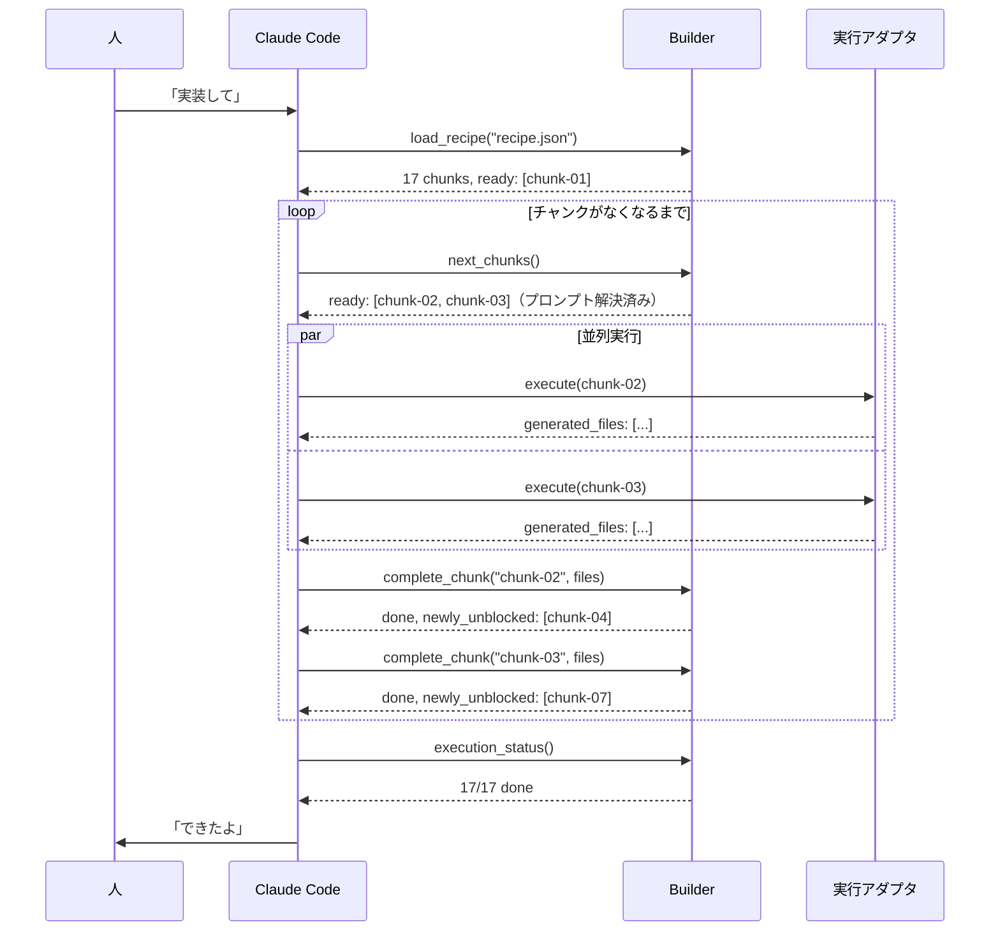
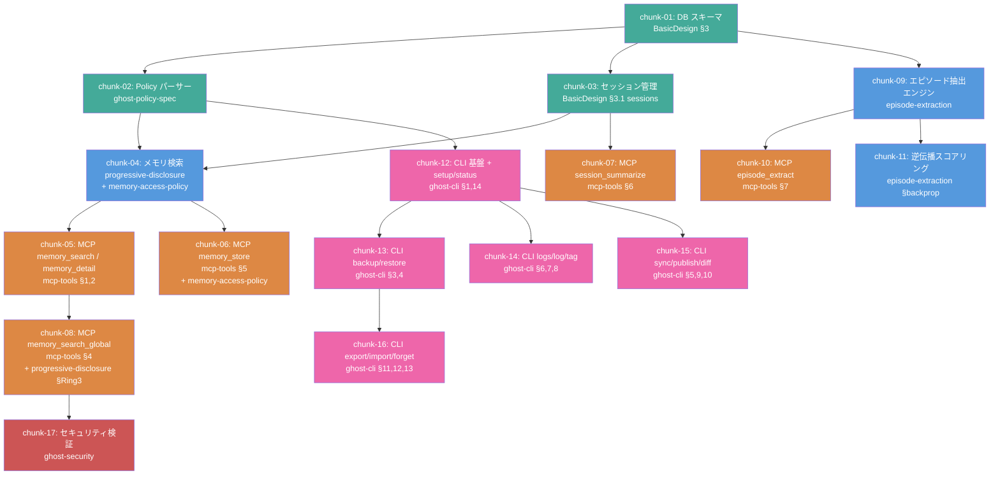

# CDD-Builder 設計書

## 1. 概要

CDD-Builder は、完成した設計文書群を読み取り、LLM が実装可能な粒度に分割し、自律的に実行する MCP サーバー。
CDD（Character Driven Development）の「設計は精密に、実装はシンプルに」を実現するための **設計→実装の自動翻訳・実行エンジン**。

### 解決する問題

設計文書を LLM に一括で渡すと:
- コンテキストウィンドウを圧迫し、後半で精度が落ちる
- 文書間の暗黙的依存を見落とす
- 実装順序を誤り、手戻りが発生する

### 位置づけ

```
人 + Claude: 楽しくおしゃべりしながら設計
                ↓
        【CDD-Planner】壁打ち・設計支援
                ↓
          設計文書群（完成品）
                ↓
        【CDD-Builder】
          ├── レシピエンジン: 設計を分析・分割・レシピ化
          └── 実行エンジン: レシピを読み、実行アダプタ経由で実装
                ↓
          実装コード（テスト済み）
```

**人は設計に集中し、実装は Builder が自動で回す。**
人は途中で口を挟んでもいいし、完全に任せてもいい。

### 設計品質とコード品質の関係

Planner で十分に壁打ちした後に Builder へ渡すと、可読性の高いアウトプットが得られる。

Builder が生成するコードの品質は、入力となる設計文書の品質に直結する。
型定義・処理ステップ・モジュール間の接続が設計で決まっていれば、Builder は「仕様を翻訳する」だけでよく、判断の余地が減る。結果として：

- 命名が一貫する（設計用語がそのままコードに降りてくる）
- テスト名が設計意図を反映する（仕様文 → テストケース名の直訳）
- 過剰な抽象化が起きない（何を作るか明確なので、「念のため」のコードが不要）
- モジュール分割が自然になる（設計のレイヤー構造がそのままディレクトリ構成に反映される）

これは Vibe コーディング（曖昧な指示で AI に一任する方式）との決定的な違いであり、CDD の「設計は精密に、実装はシンプルに」が実際のコードに現れる部分でもある。

---

## 2. アーキテクチャ

```
Builder
├── レシピエンジン（設計 → レシピ変換）
│   ├── analyze_design   … 設計文書群の構造分析
│   ├── split_chunks     … 実装チャンクへの分割
│   ├── validate_refs    … 参照整合性チェック
│   └── export_recipe    … レシピファイル出力
│
├── 実行エンジン（レシピ → 実装コード）
│   ├── load_recipe      … レシピ読み込み・実行状態初期化
│   ├── next_chunks      … 次の実行可能チャンクを返す
│   ├── complete_chunk   … チャンク完了の検証・記録
│   └── execution_status … 全体進捗の可視化
│
└── 実行アダプタ（差し替え可能）
    ├── claude-code      … Claude Code の Task エージェント（デフォルト）
    ├── local-llm        … Ollama, llama.cpp 等
    └── (将来)           … 任意の LLM / エージェント
```

### 設計原則

- **レシピエンジンは LLM に依存しない。** 純粋に「何を、どの順で、どこまでやるか」を管理する
- **実行アダプタは差し替え可能。** インターフェースだけ決め、実装は自由
- **実装プロンプトは素の自然言語。** 特定の API 形式に依存しない。Claude でもローカル LLM でも読める

---

## 3. MCP ツール仕様 — レシピエンジン

### 3.1 `analyze_design`

設計文書群を読み取り、構造を分析する。

**入力:**
```json
{
  "doc_paths": ["path/to/BasicDesign.md", "path/to/mcp-tools.md", "..."],
  "project_name": "AI-Ghost-Shell",
  "project_dir": "path/to/Documents/AI-Ghost-Shell/"
}
```

`project_dir` を指定すると、ディレクトリ内の `decisions.jsonl` も自動で読み込む。

**処理:**
1. 各文書を読み取り、メタデータを抽出（行数、セクション構成）
2. Planner が付与したフロントマター（`status`, `layer`, `decisions`, `open_questions`）があれば優先使用。なければ本文から推定
3. `[[wiki-link]]` やセクション参照から文書間の依存グラフを構築
4. `decisions.jsonl` があれば、決定事項と影響文書の関係を依存グラフに反映
5. 各文書をレイヤーに分類
6. 技術選定に関する記述を設計文書から抽出（→ recipe.json の `tech_stack` に反映）
7. 推定トークン数を算出

**出力:**
```json
{
  "project_name": "AI-Ghost-Shell",
  "documents": [
    {
      "path": "BasicDesign.md",
      "lines": 484,
      "estimated_tokens": 3200,
      "layer": "foundation",
      "sections": ["ER図", "テーブル定義", "エディション構成"],
      "references_to": ["episode-extraction.md", "ghost-policy-spec.md"],
      "referenced_by": ["mcp-tools.md", "ghost-cli.md", "operation-flows.md"]
    }
  ],
  "dependency_graph": { ... },
  "layers": {
    "foundation": ["BasicDesign.md", "memory-access-policy.md", "progressive-disclosure.md"],
    "specification": ["ghost-policy-spec.md", "episode-extraction.md", "ghost-security.md"],
    "usecase": ["ai-ghost-backup-usecases.md", "ai-side-usecases.md"],
    "interface": ["mcp-tools.md", "ghost-cli.md"],
    "execution": ["operation-flows.md", "ベンチマーク_ログ抽出クエリ.md"],
    "context": ["prior-art-comparison.md", "ToDo.md"]
  },
  "total_tokens": 33000
}
```

### 3.2 `split_chunks`

分析結果を元に、実装チャンクに分割する。

**入力:**
```json
{
  "analysis": "（analyze_design の出力）",
  "strategy": "bottom_up",
  "constraints": {
    "max_input_tokens": 8000,
    "max_output_tokens": 12000,
    "max_source_docs": 2,
    "max_output_files": 5
  }
}
```

**分割ロジック:**

```
Step 1: 依存グラフをトポロジカルソート
         → 被依存が多い文書から実装順序を決定

Step 2: 実装レイヤーにマッピング
         設計レイヤー          実装レイヤー
         ──────────          ──────────
         foundation     →    データ層（DB, スキーマ）
         specification  →    ビジネスロジック層
         usecase        →    （実装には直接使わない。検証基準として参照）
         interface      →    API / CLI 層
         execution      →    （テスト・ベンチマーク用）
         context        →    （実装対象外）

Step 3: 各レイヤー内でチャンクに分割
         分割基準:
         - 1チャンク = 1つの凝集した機能単位
         - 参照する設計文書は 1〜2 本
         - 生成するファイルは 3〜5 本
         - 完了条件がテスト可能
```

**出力:**
```json
{
  "chunks": [
    {
      "id": "chunk-01",
      "name": "データベーススキーマ",
      "description": "ghost.db の5テーブル作成 + マイグレーション",
      "source_docs": [
        {
          "path": "BasicDesign.md",
          "sections": ["3. ER図", "3.1 テーブル定義"],
          "include": "partial"
        }
      ],
      "expected_outputs": [
        "src/db/schema.sql",
        "src/db/migrations/001_initial.sql",
        "src/db/connection.ts",
        "tests/db/schema.test.ts"
      ],
      "completion_criteria": [
        "5テーブルが作成される",
        "マイグレーションが冪等に実行できる",
        "テストが通る"
      ],
      "depends_on": [],
      "estimated_input_tokens": 2500,
      "estimated_output_tokens": 4000
    },
    {
      "id": "chunk-02",
      "name": "ghost-policy.toml パーサー",
      "depends_on": ["chunk-01"],
      "source_docs": [
        {
          "path": "ghost-policy-spec.md",
          "sections": ["全体"],
          "include": "full"
        }
      ],
      ...
    }
  ],
  "execution_order": [
    ["chunk-01"],
    ["chunk-02", "chunk-03"],
    ["chunk-04"],
    ...
  ]
}
```

`execution_order` は DAG のレベル順。同一レベルのチャンクは並列実行可能。

### 3.3 `validate_refs`

設計文書間の参照整合性をチェックする。

**Planner の `check_consistency` との違い:**
- Planner `check_consistency`: 設計フェーズ中の壁打ちで使う。用語の揺れや決定ログとの乖離など、設計内容の品質を検出する
- Builder `validate_refs`: レシピ化の直前に使う。Planner で解消済みの前提で、**チャンク分割に必要な参照の構造的整合性**（リンク切れ、ID欠番、カバレッジ）に絞ってチェックする

**入力:**
```json
{
  "doc_paths": ["..."]
}
```

**チェック項目:**

| チェック | 内容 |
|---------|------|
| 未解決参照 | `[[wiki-link]]` のリンク切れ |
| テーブル名不一致 | 文書Aの `episode_memories` と文書Bの `episodes` が同じものを指していないか |
| ユースケース欠番 | UC-1〜13 / AC-1〜7 に抜け漏れがないか |
| フロー図カバレッジ | operation-flows が主要ユースケースを網羅しているか |
| ポリシー設定漏れ | ghost-policy-spec に記載のキーが他文書で言及されているか |

**出力:**
```json
{
  "status": "warn",
  "issues": [
    {
      "severity": "warn",
      "type": "table_name_mismatch",
      "message": "episode-extraction.md L42: 'episodes' → BasicDesign.md では 'episode_memories'",
      "locations": ["episode-extraction.md:42", "BasicDesign.md:128"]
    }
  ]
}
```

### 3.4 `export_recipe`

チャンク群を実行エンジンが読めるレシピファイルとして出力する。

**入力:**
```json
{
  "chunks": "（split_chunks の出力）",
  "output_path": "path/to/recipe.json",
  "include_source_content": true
}
```

**処理:**
- 各チャンクの `source_docs` で参照されるセクションを**実際に抽出**し、レシピに埋め込む
- チャンク単体で実装に必要な情報が揃うようにする（外部参照不要）
- ユースケース文書は `validation_context` として添付（実装指示には使わない、検証用）
- `tech_stack` は `analyze_design` が設計文書から抽出した技術選定情報をそのまま載せる（Planner の `check_readiness` で技術選定済みであることが保証されている）

**出力: recipe.json の構造**
```json
{
  "project": "AI-Ghost-Shell",
  "created_at": "2026-03-02T...",
  "builder_version": "0.1.0",
  "tech_stack": {
    "language": "TypeScript",
    "runtime": "Node.js",
    "db": "SQLite",
    "test": "vitest",
    "platforms": ["linux", "macos"],
    "platform_notes": "Git版はgitコマンド必須。Lite版はSQLiteのみ",
    "directory_structure": "src/ + tests/"
  },
  "chunks": [
    {
      "id": "chunk-01",
      "name": "データベーススキーマ",
      "depends_on": [],
      "source_content": "## 3. ER図\n...(実際の設計文書の該当セクション)...",
      "implementation_prompt": "以下の設計に基づき、SQLite データベースのスキーマとマイグレーションを実装してください。\n\n{source_content}",
      "expected_outputs": ["..."],
      "completion_criteria": ["..."],
      "validation_context": "UC-1: 初期セットアップで ghost.db が作成される"
    }
  ],
  "execution_order": [...]
}
```

---

## 4. MCP ツール仕様 — 実行エンジン

### 4.1 `load_recipe`

レシピファイルを読み込み、実行状態を初期化する。

**入力:**
```json
{
  "recipe_path": "path/to/recipe.json"
}
```

**処理:**
1. recipe.json を読み込み、構造を検証
2. 各チャンクの状態を `pending` で初期化
3. 依存グラフから即座に実行可能なチャンクを特定
4. 実行状態ファイル（`execution-state.json`）を生成

**出力:**
```json
{
  "project": "AI-Ghost-Shell",
  "total_chunks": 17,
  "ready_chunks": ["chunk-01"],
  "execution_state_path": "path/to/execution-state.json"
}
```

**execution-state.json の構造:**
```json
{
  "recipe_path": "path/to/recipe.json",
  "started_at": "2026-03-03T...",
  "chunks": {
    "chunk-01": { "status": "pending", "started_at": null, "completed_at": null, "outputs": [] },
    "chunk-02": { "status": "pending", "started_at": null, "completed_at": null, "outputs": [] }
  }
}
```

### 4.2 `next_chunks`

依存が解決済みのチャンクを返す。プレースホルダを実際のコードに差し込み済みの、**そのまま実行可能な実装指示**を組み立てる。

**入力:**
```json
{
  "execution_state_path": "path/to/execution-state.json"
}
```

**処理:**
1. 実行状態から `pending` かつ依存が全て `done` のチャンクを抽出
2. 各チャンクの `source_content` 内の `{{file:...}}` プレースホルダを、実際のファイル内容に置換
3. 実装プロンプトを組み立てる

**プレースホルダ解決の例:**
```
chunk-04 の source_content に含まれる:
  {{file:src/db/schema.ts}}
  → chunk-01 で生成された実際の schema.ts の内容に置換

  {{file:src/policy/parser.ts}}
  → chunk-02 で生成された実際の parser.ts の内容に置換
```

**出力:**
```json
{
  "ready": [
    {
      "id": "chunk-02",
      "name": "ghost-policy.toml パーサー",
      "implementation_prompt": "（プレースホルダ解決済みの完全な実装指示）",
      "expected_outputs": ["src/policy/parser.ts", "src/policy/types.ts", "tests/policy/parser.test.ts"],
      "completion_criteria": ["TOML パースが成功する", "不正な設定でエラーを返す", "テストが通る"]
    },
    {
      "id": "chunk-03",
      "name": "セッション管理",
      "implementation_prompt": "...",
      ...
    }
  ],
  "blocked": ["chunk-04", "chunk-05", "..."],
  "done": ["chunk-01"],
  "progress": "1/17 完了"
}
```

### 4.3 `complete_chunk`

チャンクの完了を検証し、記録する。

**入力:**
```json
{
  "execution_state_path": "path/to/execution-state.json",
  "chunk_id": "chunk-01",
  "generated_files": ["src/db/schema.sql", "src/db/connection.ts", "tests/db/schema.test.ts"]
}
```

**処理:**
1. `expected_outputs` に対してファイルの存在を確認
2. テストファイルがあればテストを実行
3. `completion_criteria` を可能な範囲で自動検証
4. 状態を `done` に更新、後続チャンクをアンロック

**検証レベル:**

| レベル | 内容 | 自動化 |
|--------|------|--------|
| ファイル存在 | expected_outputs が全て存在するか | 完全自動 |
| テスト通過 | テストファイルが pass するか | 完全自動 |
| 基準照合 | completion_criteria を満たすか | 一部自動（テスト結果で判断可能なもの） |

**出力:**
```json
{
  "chunk_id": "chunk-01",
  "status": "done",
  "verification": {
    "files_exist": true,
    "tests_passed": true,
    "criteria_met": ["5テーブルが作成される: OK", "マイグレーションが冪等: OK", "テストが通る: OK"]
  },
  "newly_unblocked": ["chunk-02", "chunk-03", "chunk-09"]
}
```

**失敗時:**
```json
{
  "chunk_id": "chunk-01",
  "status": "failed",
  "verification": {
    "files_exist": false,
    "missing_files": ["src/db/migrations/001_initial.sql"],
    "tests_passed": false,
    "test_errors": ["..."  ]
  },
  "action": "retry"
}
```

失敗したチャンクは `failed` 状態に。再実行時は `next_chunks` が再度返す。

### 4.4 `execution_status`

全体の実行進捗を可視化する。

**入力:**
```json
{
  "execution_state_path": "path/to/execution-state.json"
}
```

**出力:**
```json
{
  "progress": {
    "done": 5,
    "in_progress": 2,
    "pending": 8,
    "failed": 1,
    "blocked": 1,
    "total": 17
  },
  "chunks": [
    { "id": "chunk-01", "name": "DB スキーマ", "status": "done" },
    { "id": "chunk-02", "name": "Policy パーサー", "status": "in_progress" },
    { "id": "chunk-04", "name": "メモリ検索コア", "status": "blocked", "blocked_by": ["chunk-02"] },
    { "id": "chunk-09", "name": "エピソード抽出", "status": "failed", "retry_count": 1 }
  ],
  "current_level": 1,
  "estimated_remaining": "12 chunks"
}
```

---

## 5. 実行アダプタ

### 5.1 インターフェース

実行アダプタは以下のインターフェースを満たす。
Builder のレシピエンジン・実行エンジンは LLM に依存せず、アダプタだけが LLM を知っている。

```typescript
interface ChunkExecutor {
  /**
   * チャンクの実装プロンプトを受け取り、ファイルを生成する。
   * プロンプトは自然言語 + コード断片。特定のAPI形式に依存しない。
   */
  execute(chunk: PreparedChunk): Promise<ExecutionResult>
}

interface PreparedChunk {
  id: string
  name: string
  implementation_prompt: string   // プレースホルダ解決済みの自然言語プロンプト
  expected_outputs: string[]      // 生成すべきファイルパス
  completion_criteria: string[]   // 完了条件（自然言語）
  working_dir: string             // 実装先ディレクトリ
}

interface ExecutionResult {
  success: boolean
  generated_files: string[]       // 実際に生成されたファイルパス
  error?: string                  // 失敗時のエラー内容
}
```

### 5.2 アダプタ実装例

**claude-code アダプタ（デフォルト）:**

Claude Code の Task エージェントを利用。並列実行が可能。

```
next_chunks() → [chunk-02, chunk-03]

→ Task(subagent, prompt=chunk-02.implementation_prompt) ─┐
→ Task(subagent, prompt=chunk-03.implementation_prompt) ─┤ 並列
                                                         ↓
complete_chunk("chunk-02") ──→ 検証
complete_chunk("chunk-03") ──→ 検証
```

**local-llm アダプタ:**

ローカル LLM（Ollama 等）の API を呼び出す。

```
next_chunks() → [chunk-02]

→ HTTP POST ollama:11434/api/generate
  { model: "codellama", prompt: chunk-02.implementation_prompt }
→ レスポンスからコードブロックを抽出
→ ファイルに書き出し

complete_chunk("chunk-02") ──→ 検証
```

**アダプタの選択:**
```json
{
  "executor": {
    "type": "claude-code",
    "config": {}
  }
}
```
または
```json
{
  "executor": {
    "type": "local-llm",
    "config": {
      "endpoint": "http://localhost:11434",
      "model": "codellama:34b"
    }
  }
}
```

recipe.json またはコマンドライン引数で指定。

### 5.3 モデルルーティング

アダプタはチャンクのメタデータに基づき、内部でモデルを振り分けることができる。
Builder 本体はモデル選択を関知しない。ルーティングはアダプタの中で閉じる。

**ルーティングの判断材料（チャンクに含まれる情報）:**

| シグナル | 例 | 示唆 |
|---------|-----|------|
| `estimated_output_tokens` | 4000 / 12000 | 出力規模 → 大きいほど高性能モデル |
| `source_docs` の数 | 1本 / 2本 | 参照設計の量 → 多いほど文脈理解力が必要 |
| レイヤー | データ層 / ロジック層 | ロジック層は判断が多い → 高性能モデル |
| `completion_criteria` の複雑さ | テスト通過 / 整合性検証 | 複雑な基準 → 高性能モデル |

**設定例（claude-code アダプタ）:**
```json
{
  "executor": {
    "type": "claude-code",
    "config": {
      "routing": {
        "default": "haiku",
        "rules": [
          { "when": "estimated_output_tokens > 8000", "use": "sonnet" },
          { "when": "source_docs_count >= 2", "use": "sonnet" },
          { "when": "layer == 'specification'", "use": "sonnet" }
        ]
      }
    }
  }
}
```

**設定例（local-llm アダプタ）:**
```json
{
  "executor": {
    "type": "local-llm",
    "config": {
      "endpoint": "http://localhost:11434",
      "routing": {
        "default": "codellama:7b",
        "rules": [
          { "when": "estimated_output_tokens > 8000", "use": "codellama:34b" }
        ]
      }
    }
  }
}
```

ルーティングルールは上から順に評価し、最初にマッチしたモデルを使用する。どれにもマッチしなければ `default` を使用する。

---

## 6. 実行フロー全体像



### 人の介入ポイント

人は完全に任せてもいいし、以下のタイミングで介入できる:

| タイミング | 介入例 |
|-----------|-------|
| 実行前 | レシピを確認して順序を調整 |
| チャンク失敗時 | エラー内容を見て方針を指示 |
| 途中経過確認 | `execution_status` で進捗を確認 |
| 完了後 | 生成コードをレビュー |

---

## 7. AI-Ghost-Shell で検証：分割シミュレーション

14本の設計文書を Builder に通した場合の想定チャンク分割:



**凡例:** 緑: データ層 / 青: ロジック層 / 橙: MCP層 / 紫: CLI層 / 赤: セキュリティ

### チャンク一覧

| ID | チャンク名 | 参照設計書 | 推定入力 | 依存 |
|----|-----------|-----------|---------|------|
| 01 | DB スキーマ | BasicDesign §3 | ~2.5k | なし |
| 02 | Policy パーサー | ghost-policy-spec | ~3.5k | 01 |
| 03 | セッション管理 | BasicDesign §3.1 | ~2.0k | 01 |
| 04 | メモリ検索コア | progressive-disclosure + memory-access-policy | ~4.0k | 02, 03 |
| 05 | MCP memory_search / detail | mcp-tools §1,2 | ~3.0k | 04 |
| 06 | MCP memory_store | mcp-tools §5 + memory-access-policy | ~2.5k | 04 |
| 07 | MCP session_summarize | mcp-tools §6 | ~2.0k | 03 |
| 08 | MCP memory_search_global | mcp-tools §4 + progressive-disclosure §Ring3 | ~2.5k | 05 |
| 09 | エピソード抽出エンジン | episode-extraction | ~4.0k | 01 |
| 10 | MCP episode_extract | mcp-tools §7 | ~2.0k | 09 |
| 11 | 逆伝播スコアリング | episode-extraction §backprop | ~3.0k | 09 |
| 12 | CLI 基盤 + setup/status | ghost-cli §1,14 | ~3.0k | 02 |
| 13 | CLI backup/restore | ghost-cli §3,4 | ~3.0k | 12 |
| 14 | CLI logs/log/tag | ghost-cli §6,7,8 | ~3.0k | 12 |
| 15 | CLI sync/publish/diff | ghost-cli §5,9,10 | ~3.0k | 12 |
| 16 | CLI export/import/forget | ghost-cli §11,12,13 | ~3.0k | 13 |
| 17 | セキュリティ検証 | ghost-security | ~2.0k | 08 |

**並列実行レベル:**
```
Lv.0: [01]
Lv.1: [02, 03]
Lv.2: [04, 09]
Lv.3: [05, 06, 07, 10, 11, 12]
Lv.4: [08, 13, 14, 15]
Lv.5: [16, 17]
```

最大5レベル、Lv.3 で6並列。Builder が並列実行すれば大幅に短縮可能。

---

## 8. チャンク分割の原則

### 8.1 サイズ制約

| 項目 | 制約 | 根拠 |
|------|------|------|
| 参照設計文書 | 1〜2本 | 3本以上で注意散漫・整合性低下 |
| 入力トークン | 8k 以内 | 設計文書 + 既存コード参照 + プロンプト |
| 出力ファイル数 | 3〜5本 | 多すぎるとファイル間整合性が崩れる |
| 完了条件 | テスト可能 | 次チャンクの前提を保証する |

### 8.2 分割の判断基準

**分割すべき場合:**
- 設計文書の異なるセクションが独立した機能を定義している
- 1チャンクの推定出力が 12k トークンを超える
- 異なるレイヤー（DB / ロジック / API）にまたがる

**分割すべきでない場合:**
- 2つの機能が同じテーブル・同じモジュールを密に共有する
- 分割すると片方のチャンクが小さすぎる（< 1k 出力）
- 分割するとチャンク間のインターフェース定義が必要になり、かえって複雑になる

### 8.3 既存コードの扱い

チャンク 02 以降は、前のチャンクで生成されたコードを参照する必要がある。

```
chunk-04 の入力:
  - 設計文書: progressive-disclosure.md（該当セクション）
  - 既存コード: chunk-01 で生成した schema.ts の型定義
  - 既存コード: chunk-02 で生成した policy.ts のインターフェース
  → これらを source_content にまとめて渡す
```

レシピの `source_content` にはファイルパスのプレースホルダを記述し、
`next_chunks` が実行時に実際のコードを差し込む:

```json
{
  "source_content": "{{file:src/db/schema.ts}}\n\n---\n\n## 設計: progressive-disclosure.md\n..."
}
```

---

## 9. 技術スタック

| 項目 | 選定 | 理由 |
|------|------|------|
| 言語 | TypeScript | MCP SDK の公式サポート |
| MCP SDK | `@modelcontextprotocol/sdk` | 標準 |
| パーサー | unified + remark | Markdown の構造解析 |
| トークン推定 | tiktoken (cl100k_base) | 精度のある見積もり |
| テスト | vitest | 軽量・高速 |
| 実行状態 | JSON ファイル | シンプル、外部DB不要 |

---

## 10. 未決事項

- [ ] `implementation_prompt` のテンプレート最適化（実際に実行して調整）
- [ ] ユースケース文書の `validation_context` をどこまで含めるか
- [ ] 分割戦略 `strategy` のバリエーション（bottom_up 以外に top_down, by_layer 等）
- [ ] local-llm アダプタのコード抽出ロジック（レスポンス形式が LLM ごとに異なる）
- [ ] 失敗チャンクの最大リトライ回数
- [ ] 実行途中でのレシピ修正（チャンク追加・削除・順序変更）への対応
- [ ] クロスプラットフォーム対応時の設計ガイドライン策定（tech_stack.platforms に情報は持たせる方針。具体的な分岐ロジックは実案件で詰める）
