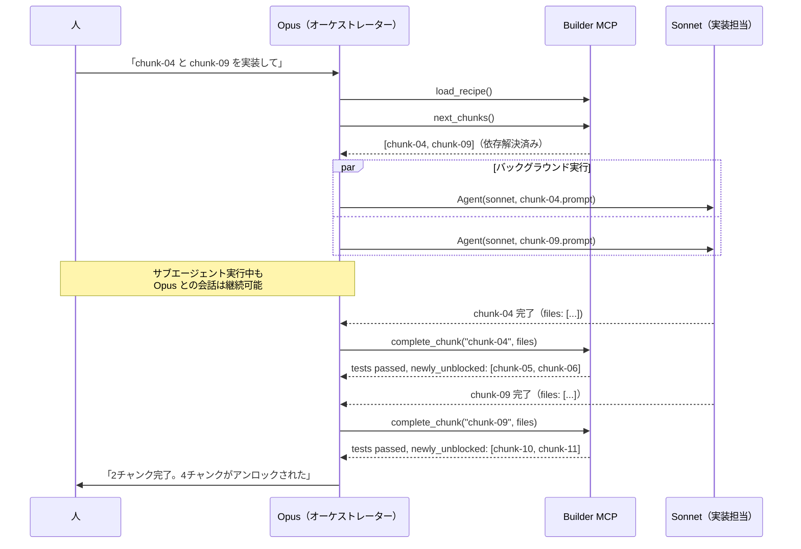
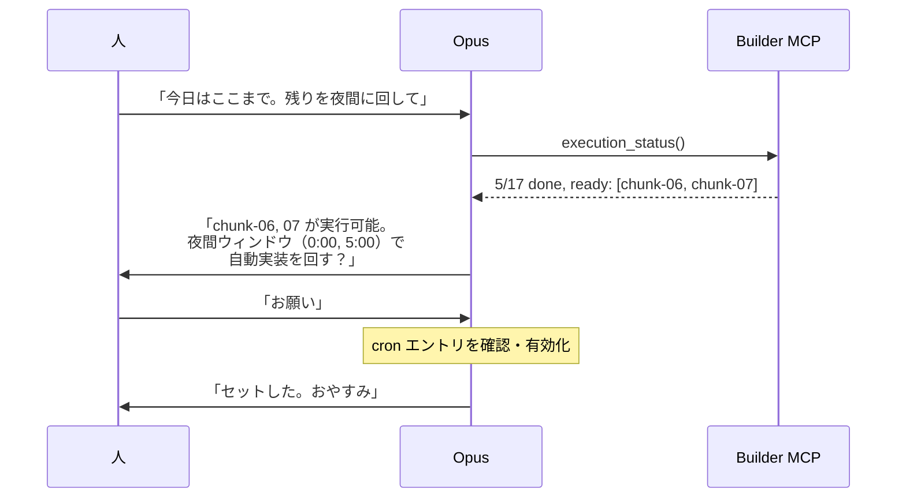
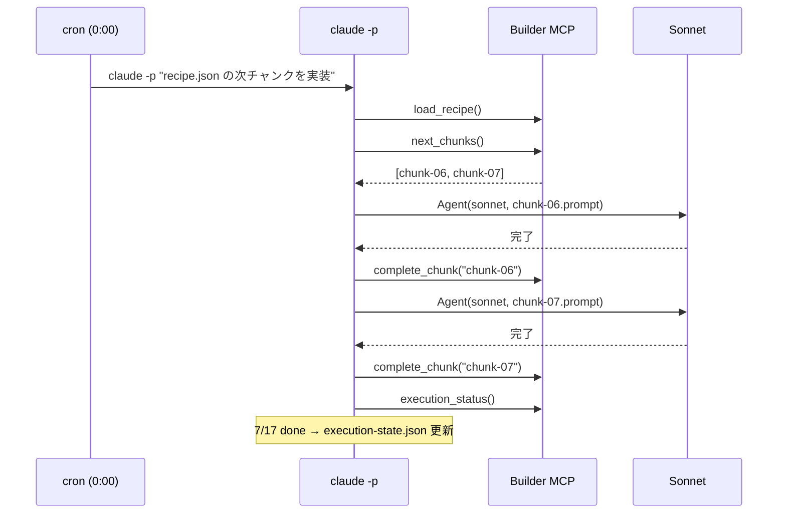
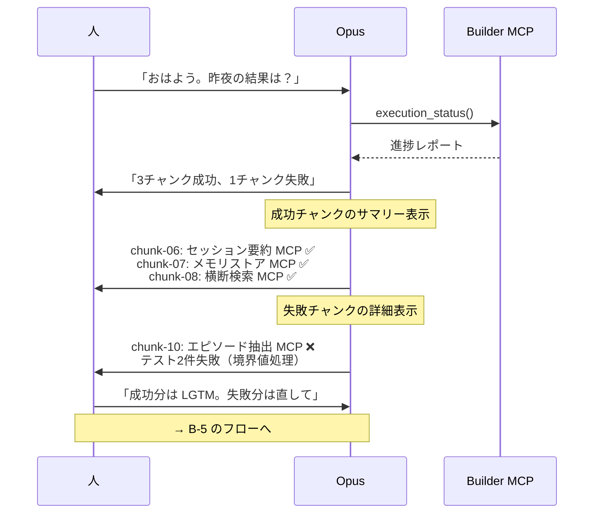
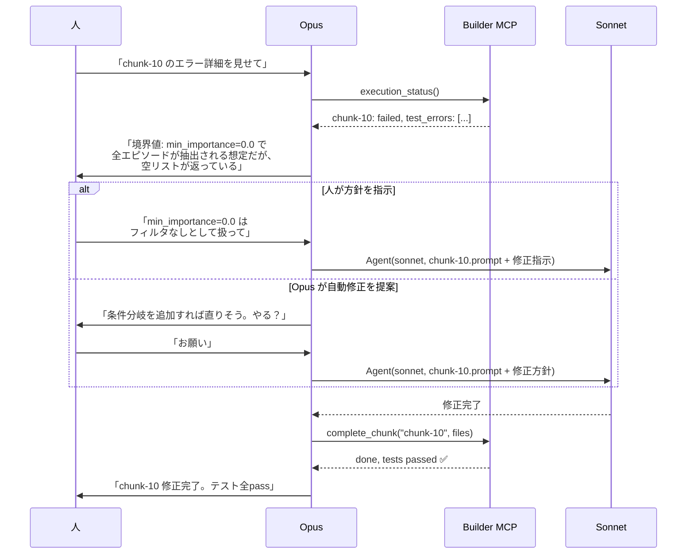
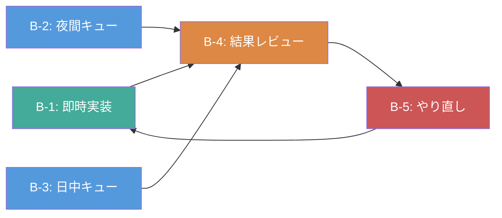

# CDD-Builder ユースケース

## 概要

Builder の実行トリガーは2種類ある:

1. **対話モード** — 会話中に人が「実装お願い」と指示
2. **ヘッドレスモード** — cron / スクリプトが `claude -p` で自動起動

どちらのモードでも、Builder MCP がレシピを管理し、サブエージェント（Sonnet/Haiku）が実装を担当する。
Opus はオーケストレーターとして温存する。

### 背景: トークンウィンドウの活用

Claude Code Pro は 5 時間ごとにトークン枠がリセットされる。
日中の作業時間以外（就寝中・出社中）の枠が未消化になっている。

ヘッドレスモードは、この空きウィンドウを自動実装に活用する仕組み。

```
  0時    5時   10時   15時   20時   24時
  |------|------|------|------|------|
  [sleep ][出社          ][帰宅    ]
  ↑cron   ↑cron          ↑対話モード
  自動実装  自動実装        人がレビュー+指示
```

---

## ユースケース一覧

| ID | ユースケース | トリガー |
|----|------------|---------|
| B-1 | 会話中に即時実装指示 | 対話 |
| B-2 | 寝る前にキューに積む → 夜間実装 | ヘッドレス |
| B-3 | 出社前にキューに積む → 日中実装 | ヘッドレス |
| B-4 | 翌朝/帰宅後に結果レビュー | 対話 |
| B-5 | 失敗チャンクのやり直し指示 | 対話 |

---

## B-1: 会話中に即時実装指示

**アクター:** 人 + Claude Code (Opus) + サブエージェント (Sonnet)

**前提条件:**
- recipe.json が生成済み
- Claude Code セッションが起動中

**フロー:**



**ポイント:**
- サブエージェントはバックグラウンド実行。Opus との別の会話を続けられる
- 同一レベルのチャンクは並列実行可能
- 完了通知がリアルタイムで届く

---

## B-2: 寝る前にキューに積む

**アクター:** 人 + Claude Code (Opus) + cron

**前提条件:**
- recipe.json が生成済み
- execution-state.json に進捗状態がある

**フロー:**





---

## B-3: 出社前にキューに積む

B-2 と同じ構造。トリガーが朝の cron ウィンドウになるだけ。

```
06:30  人: 「出社前に積んでおく。日中のウィンドウで回して」
       → execution-state.json の ready chunks を確認
       → cron が 10:00, 15:00 のウィンドウで実行
18:00  人: 帰宅 → B-4 のフローへ
```

---

## B-4: 翌朝/帰宅後に結果レビュー

**アクター:** 人 + Claude Code (Opus)

**前提条件:**
- ヘッドレスモードで実装が進んだ後

**フロー:**



**ポイント:**
- execution-state.json に全結果が構造化されている
- 人はコードを一行ずつ読まなくても、テスト結果で判断できる
- 成功チャンクの承認と失敗チャンクの対応を分離できる

---

## B-5: 失敗チャンクのやり直し指示

**アクター:** 人 + Claude Code (Opus) + サブエージェント (Sonnet)

**前提条件:**
- complete_chunk で `status: "failed"` になったチャンクがある

**フロー:**



**ポイント:**
- 失敗原因は execution-state.json に記録されている
- 人が方針を指示するか、Opus に任せるかを選べる
- リトライ時は前回のエラー情報をプロンプトに含める

---

## ユースケース間の関係



**緑:** 対話モード / **青:** ヘッドレスモード / **橙:** レビュー / **赤:** リカバリ

---

## 関連ドキュメント

- [Builder 設計書](builder-design.md) — アーキテクチャ・MCP ツール仕様
- [Planner 設計書](planner-design.md) — 設計壁打ち支援
