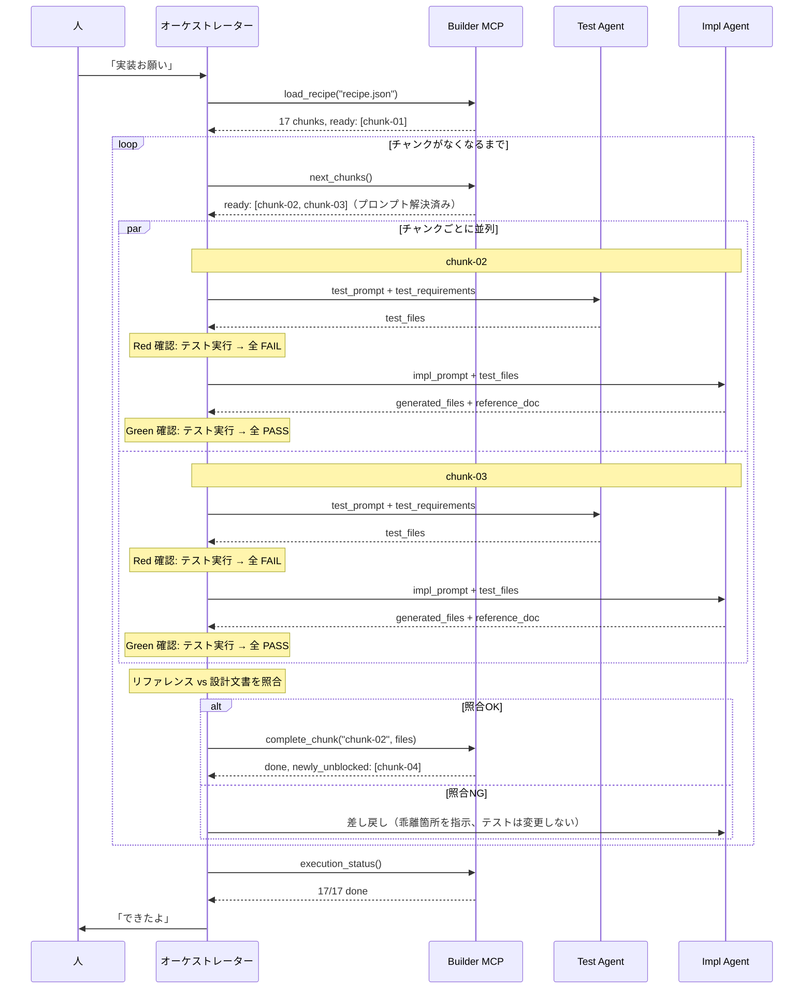

# 実行フロー機能設計書

更新日: 2026-04-11

## 1. 概要

Builder の実行フロー全体を定義する。
レシピの読み込みからチャンク実行・完了判定までの流れと、Dual-Agent TDD による品質保証の仕組みを規定する。

## 2. 構成要素

### 2.1 バウンダリ（外部との接点）

- **MCP ツール群** — レシピエンジン（`analyze_design`, `split_chunks`, `validate_refs`, `export_recipe`）+ 実行エンジン（`load_recipe`, `next_chunks`, `complete_chunk`, `execution_status`）
- **レシピファイル** — `recipe.json`（チャンク定義・実行順序・技術スタック）
- **実行状態ファイル** — `recipe-state.json`（各チャンクの進捗）
- **実行アダプタ** — claude-code / local-llm（差し替え可能）

### 2.2 エンティティ（扱うデータ）

- **チャンク（Chunk）** — 実装の最小単位。設計文書の一部 + 実装プロンプト + 完了条件
- **DraftChunk** — `split_chunks` 出力の中間型。`export_recipe` で Chunk に変換される
- **実行状態** — 各チャンクの status（pending / in_progress / done / failed / blocked）
- **依存グラフ** — チャンク間の実行順序を決定する DAG

### 2.3 コントローラー（主要な処理）

- **レシピ生成パイプライン** — analyze → split → validate → export の 4 ステップ
- **依存解決** — DAG のトポロジカルソートで実行可能チャンクを特定
- **プレースホルダ解決** — `{{file:...}}` を前チャンクの実際のコードに置換
- **Dual-Agent TDD** — Test Agent（Red）→ Impl Agent（Green）→ オーケストレーター（照合）
- **完了検証** — ファイル存在・テスト通過・基準照合・テスト品質の 4 レベル

## 3. ユースケース

- UC-1/AC-1: 設計文書群からレシピを生成し、自律的に実装する（[基本設計 §1](../basic-design.md#1-概要) 参照）

## 4. 実行フロー

### 4.1 対話モード（会話中にトリガー）



対話モードではオーケストレーターが全体を制御し、Test Agent / Impl Agent がそれぞれ別セッションで実行する。claude-code アダプタの場合、オーケストレーターは Opus、Agent は Sonnet が担当する（[実行アダプタ §2](../3-details/execution-adapter.md#22-アダプタ実装例) 参照）。

1. **Test Agent** が設計文書から逆算してテストを生成（Red）
2. **Impl Agent** がテストを PASS させる実装 + リファレンスを生成（Green）
3. **オーケストレーター** がリファレンスと設計文書を照合してから `complete_chunk` を呼ぶ

テストと実装のコンテキストが分離されているため、共有バイアスが排除される。
不具合は後続チャンクに流出する前に、Red-Green + ラウンドトリップ検証で検出される。

### 4.2 Dual-Agent TDD

チャンク実行を **テスト生成と実装生成の2フェーズに分離** し、共有バイアスを排除する。

```
Phase 1 — Red: Test Agent（設計文書 + test_requirements のみがコンテキスト）
    → テストコード生成
    → テスト実行 → 全 FAIL を確認（Red の保証）

Phase 2 — Green: Impl Agent（テストコード + 設計文書がコンテキスト）
    → 実装コード + リファレンス生成
    → テスト実行 → 全 PASS を確認（Green の保証）

Phase 3 — Review: オーケストレーター
    → リファレンス vs 設計文書の照合（ラウンドトリップ検証）
    → OK → complete_chunk → 後続アンロック
    → NG → Impl Agent に差し戻し（最大リトライ回数まで）
    → リトライ超過 → 人に判断を仰ぐ
```

**なぜ分離が効くか（共有バイアス問題の排除）:**

同じ LLM が同じコンテキストでテストと実装を同時に生成すると、同じ誤解・同じ仮定に基づくため、仕様との乖離を検出できない（共有バイアス問題）。CDD-Ghost の実装で実際に発生した事例:

- エージェントが `tone_guide` を `configs` テーブルで実装 → 同じエージェントが `configs` のテストを書く → テスト通過 → 設計文書では `tone_guide` テーブルだった
- `ghost_profile` の `ghost_name` パラメータを無視する実装 → 同じエージェントがパラメータなしのテストを書く → テスト通過

Test Agent は実装を見ていないので、「実装に合わせたテスト」を書けない。テストは設計文書と `test_requirements` から逆算されるため、実装漏れがあればテストが FAIL する。

**Red フェーズの意義:**

テストを書いた時点で実装がまだ存在しないため、テストは必ず FAIL する（Red）。もしテストが最初から PASS する場合、テストが何も検証していない（`assert True` 等）ことを意味するため、テスト自体の品質問題として検出できる。

### 4.3 Issue 駆動のチャンク管理（外部可視化レイヤー）

実行エンジンのローカル状態（execution-state.json）に加え、Gitea/GitHub Issue をチャンクの進捗可視化・エージェント間通信に使う。

**目的:**
- 人が Issue ボードを見るだけで進捗が分かる（execution_status を呼ぶ必要がない）
- セッションが切れても Issue に状態が残る（resume 時の迷子防止）
- Maintainer が Issue を見て自律的に行動できる（ラベルトリガー）
- 失敗チャンクの Issue にログが残る（デバッグ・振り返り用）

**状態管理の二層構造:**

```
execution-state.json（ローカル）
  → 高速な状態遷移・依存解決に使う（実行エンジンの内部状態）

Issue（外部）
  → 状態変更のたびに同期（イベントソーシング的）
  → 人・Maintainer・他プロジェクトから参照可能
```

**Issue のライフサイクル:**

| タイミング | アクション |
|-----------|-----------|
| `load_recipe` 実行時 | 各チャンクに対応する Issue を一括作成（ラベル: pending） |
| `next_chunks` でチャンク開始時 | ラベル: in_progress |
| Dual-Agent TDD の各フェーズ完了時 | Issue にコメント追記（Red/Green 確認結果） |
| 照合完了時 | Issue にコメント追記（照合サマリー） |
| `complete_chunk` 成功時 | Issue クローズ + 後続 Issue にラベル: ready 付与 |
| `complete_chunk` 失敗時 | ラベル: failed + エラー内容をコメントに記録 |

**CDD-Ghost 連絡帳との関係:**

Issue の作成・更新には CDD-Ghost の `notebook_write` / `notebook_close` の仕組みを利用できる。チャンク Issue は連絡帳 Issue とはラベルで区別する。

| ラベル | 用途 |
|--------|------|
| `notebook` | CDD-Ghost 連絡帳（プロジェクト間通信） |
| `chunk` | Builder チャンク管理 |
| `chunk:pending` / `chunk:in_progress` / `chunk:failed` | チャンクの状態 |

Issue リポジトリは recipe.json に指定。未指定の場合、Issue 連携はスキップ（ローカルのみで動作）。

### 4.4 人の介入ポイント

人は完全に任せてもいいし、以下のタイミングで介入できる:

| タイミング | 介入例 |
|-----------|-------|
| 実行前 | レシピを確認して順序を調整 |
| チャンク失敗時 | エラー内容を見て方針を指示 |
| 照合NG時 | 設計の意図を補足して方針を指示 |
| 途中経過確認 | `execution_status` で進捗を確認 |
| 完了後 | 生成コードとリファレンスをレビュー |

## 5. 設計判断

### なぜ Test Agent と Impl Agent を分離するか

共有バイアスの排除。同一 LLM が同一コンテキストでテスト+実装を生成すると、同じ誤解に基づくコードが生まれ、仕様との乖離を検出できない。

### なぜ Issue 駆動を併用するか

execution-state.json はローカルファイルのため、セッションが切れると状態を見失う。Issue に同期しておけば、どこからでも進捗を確認でき、Maintainer との連携も可能になる。

## 6. 検証方針

- レシピ生成パイプライン（analyze → split → validate → export）の各ステップが正しく連鎖するか
- Dual-Agent TDD で共有バイアスが実際に排除されるか（CDD-Ghost での再現テスト）
- Issue 同期のタイミングと状態遷移の整合性

## 関連ドキュメント

- [基本設計](../basic-design.md)
- [ラウンドトリップ検証](roundtrip-verification.md)
- [MCP ツール詳細設計](../3-details/mcp-tools.md)
- [実行アダプタ詳細設計](../3-details/execution-adapter.md)
