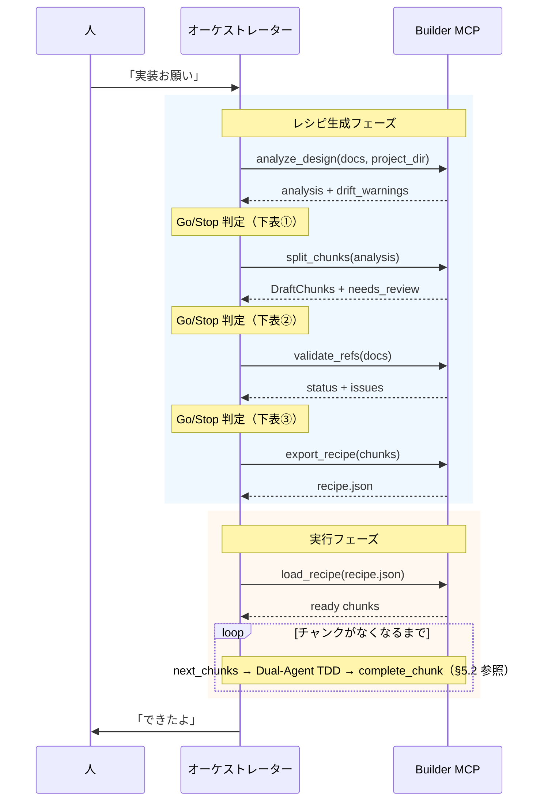
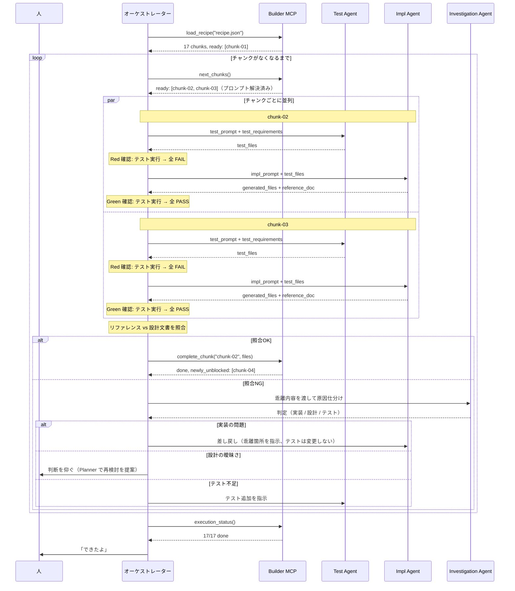

# 実行フロー機能設計書

更新日: 2026-04-12

## 1. 概要

Builder の実行フロー全体を定義する。
レシピの読み込みからチャンク実行・完了判定までの流れと、Dual-Agent TDD + Investigation による品質保証の仕組みを規定する。

## 2. 構成要素

### 2.1 バウンダリ（外部との接点）

- **MCP ツール群** — レシピエンジン（`analyze_design`, `split_chunks`, `validate_refs`, `export_recipe`）+ 実行エンジン（`load_recipe`, `next_chunks`, `complete_chunk`, `execution_status`）
- **レシピファイル** — `recipe.json`（チャンク定義・実行順序・技術スタック・コード規約参照）
- **実行状態ファイル** — `execution-state.json`（各チャンクの進捗）
- **コード規約資産** — `AGENTS.md` / `CODING-STANDARDS.md` / `.editorconfig` / linter 設定 / lint・format スクリプト（プロジェクトに存在する場合のみ）
- **実行アダプタ** — claude-code / local-llm（差し替え可能）
- **実行エージェント** — Test Agent / Impl Agent / Investigation Agent（アダプタ経由で起動）

### 2.2 エンティティ（扱うデータ）

- **チャンク（Chunk）** — 実装の最小単位。設計文書の一部 + 実装プロンプト + 完了条件
- **DraftChunk** — `split_chunks` 出力の中間型。`export_recipe` で Chunk に変換される
- **実行状態** — 各チャンクの status（pending / in_progress / done / failed / blocked）
- **依存グラフ** — チャンク間の実行順序を決定する DAG
- **照合結果** — リファレンスと設計文書の乖離分類（致命的 / 要更新 / 軽微）

### 2.3 コントローラー（主要な処理）

- **レシピ生成パイプライン** — analyze → split → validate → export の 4 ステップ
- **依存解決** — DAG のトポロジカルソートで実行可能チャンクを特定
- **プレースホルダ解決** — `{{file:...}}` を前チャンクの実際のコードに置換
- **コード規約ダイジェスト注入** — `recipe.json` の `coding_standards` から生成したダイジェストを、Test/Impl Agent に渡すプロンプトに自動付加
- **Dual-Agent TDD** — Test Agent（Red）→ Impl Agent（Green）→ オーケストレーター（照合）
- **Investigation による原因仕分け** — 照合 NG 時に Investigation Agent が「実装の問題 / 設計の曖昧さ / テスト不足」のいずれかに分類し、適切な差し戻し先を選ぶ
- **完了検証** — ファイル存在・テスト通過・基準照合・規約適合・テスト品質の 5 レベル

## 3. ユースケース

- UC-1/AC-1: 設計文書群からレシピを生成し、自律的に実装する（[基本設計 §1](../basic-design.md#1-概要) 参照）

## 4. オーケストレーション手順

チャンク 1 つを実装するために、オーケストレーターが Step 1〜6 を順に実行する。Step 1〜2 が Dual-Agent TDD（Red → Green）、Step 3〜6 がラウンドトリップ検証と差し戻し制御。

### 4.1 Test Agent によるテスト生成（Step1: Red フェーズ）

オーケストレーターは **Test Agent** にテストコードの生成を指示する。Test Agent は **設計文書と test_requirements のみ** をコンテキストに持ち、実装コードは一切見ない。

オーケストレーターが Test Agent に渡す情報:
- チャンクの source_content（設計文書の該当セクション）
- test_requirements（interface_tests, boundary_tests, integration_refs）
- expected_outputs のうちテストファイル（*.test.*, *.spec.* 等）
- depends_on チャンクの公開インターフェース定義（型情報のみ、実装は渡さない）
- 指示: 設計仕様から逆算してテストを書け。実装は存在しないので、インポートパスは expected_outputs から推測せよ

Test Agent の出力: テストファイル群

**Red の確認:** オーケストレーターはテストを実行し、**全テストが FAIL することを確認**する。
- 全 FAIL → 正常（Red 確認 OK）。Step 2 に進む
- 一部 PASS → テストが何も検証していない可能性。Test Agent に差し戻して修正させる
- コンパイルエラー → インポートパスや型定義の問題。Test Agent に修正させる（実装の型情報を追加で渡してよい）

### 4.2 Impl Agent による実装 + リファレンス生成（Step2: Green フェーズ）

オーケストレーターは **Impl Agent**（Test Agent とは別セッション）に実装を指示する。

オーケストレーターが Impl Agent に渡す情報:
- チャンクの implementation_prompt（プレースホルダ解決済み）
- Step 1 で生成されたテストコード（これを PASS させるのが目標）
- expected_outputs（生成すべきファイル一覧、テストファイルを除く）
- completion_criteria（完了条件）
- コード規約ダイジェスト（§5.6 参照）
- reference_doc の出力先パス
- 指示: テストを全て PASS させる実装を書け。実装完了後、コードから読み取れる事実のみを日本語でリファレンスに記述せよ

**Green の確認:** オーケストレーターはテストを実行し、**全テストが PASS することを確認**する。
- 全 PASS → 正常（Green 確認 OK）。Step 3 に進む
- 一部 FAIL → Impl Agent に差し戻し（FAIL しているテストの情報を付加）

### 4.3 ラウンドトリップ照合（Step3）

オーケストレーターは以下の 2 文書を読み比べ、乖離を **致命的 / 要更新 / 軽微** の 3 段階に分類する:
- **設計文書**（チャンクの `source_docs` に対応）
- **リファレンス**（Step 2 で Impl Agent が生成）

| 重み | 次のアクション |
|------|---------------|
| 致命的 | 即差し戻し（Step 5 の Investigation Agent へ） |
| 要更新 | 設計文書の更新を人に提案 |
| 軽微 | 警告のみで通過 |

照合の観点・重み分類の具体例は [ラウンドトリップ検証 §5](roundtrip-verification.md) を参照。

### 4.4 照合結果の出力（Step4）

照合結果を **標準出力**（人への即時報告）と **ファイル**（`docs/ref/verification-{chunk_id}.md`）の両方に出力する。記録フォーマットの詳細は [ラウンドトリップ検証 §6](roundtrip-verification.md) を参照。

### 4.5 Investigation Agent による原因仕分け（Step5: 照合 NG 時のみ）

致命的な乖離が 1 件以上ある場合、オーケストレーターは **Investigation Agent**（Impl Agent / Test Agent とは別セッション）を起動する。Investigation Agent は乖離内容・設計文書・実装コード・テストコードを一望して、真因を「**実装の問題 / 設計の曖昧さ / テスト不足**」のいずれかに分類する。判定結果は Step 6 の差し戻し先決定に使う。

Investigation Agent の入力・判断材料・判定別の差し戻し先の詳細は [ラウンドトリップ検証 §7](roundtrip-verification.md) を参照。

### 4.6 分岐

Investigation の判定結果に基づき、オーケストレーターが差し戻し先を決める:

```
致命的が0件     → complete_chunk → 後続チャンクをアンロック
                   → 「要更新」があれば設計文書の更新を提案

致命的が1件以上 → Investigation Agent 起動
    ├─ 実装の問題     → Impl Agent に差し戻し（乖離箇所を指示、テストは変更しない）
    ├─ 設計の曖昧さ   → 人（または Planner）に判断を仰ぐ
    │                    → 「Planner に戻して設計を詰め直す」判断材料
    └─ テスト不足     → Test Agent にテスト追加を指示（Step 1 に戻る）

いずれの差し戻しも → リトライ回数チェック → 超過なら人に判断を仰ぐ
```

**注意:** テストは Step 1 で確定しており、Investigation が「テスト不足」と判断した場合のみ変更する。実装だけが原因なら Step 1 のテストはそのまま。

### 4.7 Issue 更新

各 Step の状態変化に合わせて、チャンクの進捗管理用 Issue を更新する。Issue 自体は `load_recipe` 時にチャンク単位で既に作成されている（→ §5.5）。

更新方針は **「正常時は寡黙、異常時だけ詳細」**。Red / Green / 照合がすべて通る正常系では Step 6 クローズ時の総括コメント 1 本だけ残し、途中経過は黙ってラベル遷移のみ。異常が起きた Step だけ、原因と差し戻し先を詳細にコメントする。こうすることで Issue ボードは「何かあったチャンクだけ読めばよい」場所になる。

| タイミング | 正常系 | 異常系 |
|-----------|--------|--------|
| Step 1 完了 | コメントなし | 一部 PASS / コンパイルエラー時、Test Agent 差し戻しの理由をコメント |
| Step 2 完了 | コメントなし | 一部 FAIL 時、FAIL テスト名と Impl Agent 差し戻しの理由をコメント |
| Step 3 完了 | コメントなし | 照合 NG 時、乖離サマリーと verification ファイルのパスをコメント |
| Step 5 完了 | — | Investigation 判定（verdict・差し戻し先・根拠）をコメント |
| Step 6: 完了 | 総括コメント 1 本（Red / Green / 照合すべて OK、所要時間）+ Issue クローズ | — |
| Step 6: 実装差し戻し | — | ラベル `in_progress` 維持、差し戻しループが 2 回目以降なら収束していない理由も付記 |
| Step 6: 設計の曖昧さ | — | ラベル `needs_human_decision` 付与、エスカレーション理由をコメント |
| Step 6: テスト不足 | — | ラベル `in_progress` 維持、Test Agent へ戻る旨をコメント |
| リトライ超過 | — | ラベル `failed` 付与、収束しなかった理由（設計曖昧さの可能性など）をコメント |

ラベル遷移（`pending` → `in_progress` → 終了状態）は状態変化のたびに必ず更新するが、コメントは上表の条件に該当する場合のみ追記する。

## 5. 実行フロー

実行フェーズでは、チャンクごとの実装を **3 つの Agent に役割分離** して進める。

- **Test Agent** — 設計文書と `test_requirements` だけを見てテストコードを書く。実装コードは一切見ない
- **Impl Agent** — テストを PASS させる実装コードを書き、実装結果からリファレンスを生成する。リファレンスは設計文書を参照せず、コードの事実だけから作成する
- **Investigation Agent** — ラウンドトリップ照合で NG が出たとき、乖離の原因を仕分ける（実装の問題 / 設計の曖昧さ / テスト不足）

テストと実装のコンテキストを分離することで共有バイアスを排除し、リファレンスを設計文書から独立させることでラウンドトリップ検証の自己参照を防ぐ。分離の意義と実例は §6 設計判断を参照。

### 5.1 パイプライン全体と自律進行基準

Builder のパイプラインは **レシピ生成フェーズ** と **実行フェーズ** の 2 段構成。オーケストレーター（Claude）は各ツール呼び出しの応答を評価し、**Go（次へ進む）/ Stop（人に判断を求める）** を判断する。



**Go/Stop 判定基準:**

| # | 遷移 | Go（自動で進める） | Stop（人に返す） |
|---|---|---|---|
| ① | analyze → split | `drift_warnings` が空、`status: draft` の文書なし | ドリフトあり（古い設計で進めるか判断必要）、draft 文書あり（Planner 行き） |
| ② | split → validate | オーケストレーターが DraftChunks を評価し、チャンク構成に重大な不備なし | `expected_outputs` が空のチャンクが多数、分割粒度が明らかに不適切 |
| ③ | validate → export | `status: "ok"` または警告のみ | 参照整合性エラー（リンク切れ、ID 欠番等） |
| — | export → load | `recipe.json` 生成成功（常に Go） | — |

**②の判断主体はオーケストレーター（LLM）。** `split_chunks` はルールベースで `needs_review: true` を常に返すため、MCP 側では Go/Stop を判定できない。オーケストレーターが DraftChunks の内容（チャンク数・サイズ・依存関係・空フィールドの数）を見て、そのまま進めるか人に見せるかを決める。

### 5.2 実行フェーズ（Dual-Agent TDD ループ）



オーケストレーターが全体を制御し、Test Agent / Impl Agent / Investigation Agent はそれぞれ別セッションで実行する。claude-code アダプタの場合、オーケストレーターは Opus、Agent は Sonnet が担当する（[実行アダプタ §3.1](../3-details/execution-adapter.md) 参照）。各 Agent の役割と分離の意義は §5.3 を参照。

### 5.3 Dual-Agent TDD + Investigation

チャンク実行を **テスト生成（Red）・実装生成（Green）・照合・原因仕分けの 4 ステップに分離** し、共有バイアスと誤判断を排除する。各 Step の詳細手順（Agent に渡す情報・確認手順・差し戻し条件）は §4 オーケストレーション手順を参照。

```
Step 1 — Red:           Test Agent がテスト生成 → 全 FAIL を確認
Step 2 — Green:         Impl Agent が実装 + リファレンス生成 → 全 PASS を確認
Step 3 — Review:        オーケストレーターがラウンドトリップ照合
Step 4 — Output:        照合結果を出力（ファイル + 標準出力）
Step 5 — Investigation: 照合 NG 時のみ、原因を 3 分類して差し戻し先を決定
Step 6 — Branch:        差し戻し or complete_chunk or エスカレーション
```

分離の意義・共有バイアス事例・Red フェーズの意味・Investigation の判断材料は §6 設計判断を参照。

### 5.4 統合テストチャンクの実行

単体テストは Dual-Agent TDD で各チャンクがカバーするが、チャンク間の接続は `split_chunks` が挿入する統合テストチャンクで検証される。統合テストチャンクは `test_requirements` のみで構成され、`implementation_prompt` を持たないため、実行時は Test Agent がテストを生成して既存の実装に対して実行する（Red フェーズはスキップ）。

挿入条件と生成方式は [チャンク分割 §5](chunk-splitting.md) を参照。

### 5.5 Issue による状態管理（外部可視化レイヤー）

実行エンジンのローカル状態（execution-state.json）に加え、Gitea/GitHub Issue をチャンクの進捗可視化・エージェント間通信に使う。

**目的:**
- 人が Issue ボードを見るだけで進捗が分かる（execution_status を呼ぶ必要がない）
- セッションが切れても Issue に状態が残る（resume 時の迷子防止）
- Maintainer（実装予定）が Issue を見て自律的に行動できる（ラベルトリガー）
- 失敗チャンクの Issue にログが残る（デバッグ・振り返り用）

**状態管理の二層構造:**

```
execution-state.json（ローカル）
  → 高速な状態遷移・依存解決に使う（実行エンジンの内部状態）

Issue（外部）
  → 状態変更のたびに同期（イベントソーシング的）
  → 人・Maintainer（実装予定）・他プロジェクトから参照可能
```

**Issue のライフサイクル:**

| タイミング | アクション |
|-----------|-----------|
| `load_recipe` 実行時 | 各チャンクに対応する Issue を一括作成（ラベル: pending） |
| `next_chunks` でチャンク開始時 | ラベル: in_progress |
| Dual-Agent TDD の各 Step 完了時 | ラベル遷移のみ。コメントは異常時のみ追記 |
| `complete_chunk` 成功時 | 総括コメント 1 本 + Issue クローズ + 後続 Issue にラベル: ready 付与 |
| `complete_chunk` 失敗時 | ラベル: failed + エラー内容をコメントに記録 |

コメント方針は **「正常時は寡黙、異常時だけ詳細」**。ラベル遷移は常に行うが、コメントは Red / Green / 照合のいずれかで異常が起きた Step と Step 6 のクローズ時のみ追記する。Step 単位の具体的な更新内容は §4.7 を参照。

**CDD-Ghost 連絡帳との関係:**

Issue の作成・更新には CDD-Ghost の `notebook_write` / `notebook_close` の仕組みを利用できる。チャンク Issue は連絡帳 Issue とはラベルで区別する。

| ラベル | 用途 |
|--------|------|
| `notebook` | CDD-Ghost 連絡帳（プロジェクト間通信） |
| `chunk` | Builder チャンク管理 |
| `chunk:pending` / `chunk:in_progress` / `chunk:failed` | チャンクの状態 |

Issue リポジトリは recipe.json に指定。未指定の場合、Issue 連携はスキップ（ローカルのみで動作）。

### 5.6 コード規約の実行時注入

`next_chunks` が `recipe.json` の `coding_standards` から規約ダイジェストを生成し、`implementation_prompt` の末尾に自動付加する。`complete_chunk` 時には `coding_standards.scripts.lint` / `format` を実行し、違反があれば Investigation Agent 経由で Impl Agent に差し戻す。

検出の優先順位・ダイジェスト生成方式・規約なし時のフォールバック挙動は [コード規約](coding-standards.md) を参照。

### 5.7 人の介入ポイント

人は完全に任せてもいいし、以下のタイミングで介入できる:

| タイミング | 介入例 |
|-----------|-------|
| 実行前 | レシピを確認して順序を調整 |
| チャンク失敗時 | エラー内容を見て方針を指示 |
| 照合NG時 | 設計の意図を補足して方針を指示 |
| 途中経過確認 | `execution_status` で進捗を確認 |
| 完了後 | 生成コードとリファレンスをレビュー |

## 6. 設計判断

### なぜ Test Agent と Impl Agent を分離するか

同じ LLM が同じコンテキストでテストと実装を同時に生成すると、同じ誤解・同じ仮定に基づくため、仕様との乖離を検出できない（共有バイアス問題）。CDD-Ghost の実装で実際に発生した事例:

- エージェントが `tone_guide` を `configs` テーブルで実装 → 同じエージェントが `configs` のテストを書く → テスト通過 → 設計文書では `tone_guide` テーブルだった
- `ghost_profile` の `ghost_name` パラメータを無視する実装 → 同じエージェントがパラメータなしのテストを書く → テスト通過

Test Agent は実装を見ていないので、「実装に合わせたテスト」を書けない。テストは設計文書と `test_requirements` から逆算されるため、実装漏れがあればテストが FAIL する。

**Red フェーズの意義:** テストを書いた時点で実装がまだ存在しないため、テストは必ず FAIL する（Red）。もしテストが最初から PASS する場合、テストが何も検証していない（`assert True` 等）ことを意味するため、テスト自体の品質問題として検出できる。

### なぜ Investigation Agent を分離するか

照合 NG を全部 Impl Agent に差し戻すと、設計が曖昧なケースで実装側が延々と修正を繰り返す「実装デッドロック」が発生する。Investigation Agent は乖離内容・設計文書・実装・テストを一望して原因を仕分けることで、「設計に戻るべき問題を実装で解こうとする」誤差し戻しを防ぎ、リトライ収束を早め、設計の曖昧さをシグナルとして人に返せる。

判断材料:
- 設計文書の該当箇所に曖昧さはないか（複数解釈が可能か）
- テストが設計要件を網羅しているか
- 実装が設計意図を取り違えていないか

### なぜ Issue による状態管理を併用するか

execution-state.json はローカルファイルのため、セッションが切れると状態を見失う。Issue に同期しておけば、どこからでも進捗を確認でき、Maintainer（実装予定）との連携も可能になる。

## 7. 検証方針

- レシピ生成パイプライン（analyze → split → validate → export）の各ステップが正しく連鎖するか
- Dual-Agent TDD で共有バイアスが実際に排除されるか（CDD-Ghost での再現テスト）
- Investigation Agent の原因仕分け精度（意図的に設計を曖昧にしたケースで正しく「設計の曖昧さ」と判定できるか）
- Issue 同期のタイミングと状態遷移の整合性

## 関連ドキュメント

- [基本設計](../basic-design.md)
- [ラウンドトリップ検証](roundtrip-verification.md)
- [MCP ツール詳細設計](../3-details/mcp-tools.md)
- [実行アダプタ詳細設計](../3-details/execution-adapter.md)
- [エージェントプロンプト詳細設計](../3-details/agent-prompts.md)
