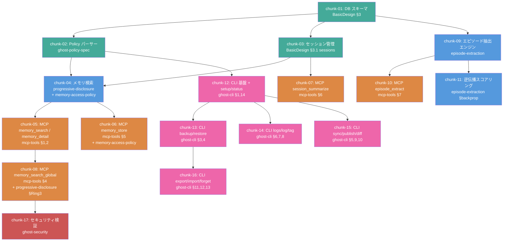

# CDD-Builder 基本設計書

更新日: 2026-04-11

## 1. 概要

CDD-Builder は、完成した設計文書群を読み取り、LLM が実装可能な粒度に分割し、自律的に実行する MCP サーバー。
CDD（Chat/Character/Chart Driven Development）の「設計は精密に、実装はシンプルに」という開発思想を実現するための **設計→実装の自動翻訳・実行エンジン**。

### 1.1 解決する問題

設計文書を LLM に一括で渡すと:
- コンテキストウィンドウを圧迫し、後半で精度が落ちる
- 文書間の暗黙的依存を見落とす
- 実装順序を誤り、手戻りが発生する

### 1.2 位置づけ

```
人 + Claude: 楽しくおしゃべりしながら設計
                ↓
        【CDD-Planner】壁打ち・設計支援
                ↓
          設計文書群（完成品）
                ↓
        【CDD-Builder】
          ├── レシピエンジン: 設計を分析・分割・レシピ化
          └── 実行エンジン: レシピを読み、実行アダプタ経由で実装
                ↓
          実装コード（テスト済み）
```

**人は設計に集中し、実装は Builder が自動で回す。**
人は途中で口を挟んでもいいし、完全に任せてもいい。

### 1.3 設計品質とコード品質の関係

Planner で十分に壁打ちした後に Builder へ渡すと、可読性の高いアウトプットが得られる。

Builder が生成するコードの品質は、入力となる設計文書の品質に直結する。
型定義・処理ステップ・モジュール間の接続が設計で決まっていれば、Builder は「仕様を翻訳する」だけでよく、判断の余地が減る。結果として：

- 命名が一貫する（設計用語がそのままコードに降りてくる）
- テスト名が設計意図を反映する（仕様文 → テストケース名の直訳）
- 過剰な抽象化が起きない（何を作るか明確なので、「念のため」のコードが不要）
- モジュール分割が自然になる（設計のレイヤー構造がそのままディレクトリ構成に反映される）

これは Vibe コーディング（曖昧な指示で AI に一任する方式）との決定的な違いであり、CDD の「設計は精密に、実装はシンプルに」が実際のコードに現れる部分でもある。

## 2. アーキテクチャ

```
Builder
├── レシピエンジン（設計 → レシピ変換）
│   ├── analyze_design   … 設計文書群の構造分析
│   ├── split_chunks     … 実装チャンクへの分割
│   ├── validate_refs    … 参照整合性チェック
│   └── export_recipe    … レシピファイル出力
│
├── 実行エンジン（レシピ → 実装コード）
│   ├── load_recipe      … レシピ読み込み・実行状態初期化
│   ├── next_chunks      … 次の実行可能チャンクを返す
│   ├── complete_chunk   … チャンク完了の検証・記録
│   └── execution_status … 全体進捗の可視化
│
└── 実行アダプタ（差し替え可能）
    ├── claude-code      … Claude Code の Task エージェント（デフォルト）
    ├── local-llm        … Ollama, llama.cpp 等
    └── (将来)           … 任意の LLM / エージェント
```

### 2.1 設計原則

- **レシピエンジンは LLM に依存しない。** 純粋に「何を、どの順で、どこまでやるか」を管理する
- **実行アダプタは差し替え可能。** インターフェースだけ決め、実装は自由
- **実装プロンプトは素の自然言語。** 特定の API 形式に依存しない。Claude でもローカル LLM でも読める

## 3. チャンク分割の原則

### 3.1 サイズ制約

| 項目 | 制約 | 根拠 |
|------|------|------|
| 参照設計文書 | 1〜2本 | 3本以上で注意散漫・整合性低下 |
| 入力トークン | 8k 以内 | 設計文書 + 既存コード参照 + プロンプト |
| 出力ファイル数 | 3〜5本 | 多すぎるとファイル間整合性が崩れる |
| 完了条件 | テスト可能 | 次チャンクの前提を保証する |

### 3.2 分割の判断基準

**分割すべき場合:**
- 設計文書の異なるセクションが独立した機能を定義している
- 1チャンクの推定出力が 12k トークンを超える
- 異なるレイヤー（DB / ロジック / API）にまたがる

**分割すべきでない場合:**
- 2つの機能が同じテーブル・同じモジュールを密に共有する
- 分割すると片方のチャンクが小さすぎる（< 1k 出力）
- 分割するとチャンク間のインターフェース定義が必要になり、かえって複雑になる

### 3.3 統合テストチャンクの自動挿入

`split_chunks` は依存関係グラフから、統合テストチャンクを自動挿入する。各チャンクの Dual-Agent TDD で単体テストはカバーされるが、チャンク間の接続は検証されない。

**挿入ルール:**

| 条件 | 挿入位置 | テスト内容 |
|------|---------|-----------|
| 依存グラフで3チャンク以上が合流するノード | 合流ノードの直後 | 合流元チャンクの出力が正しく連携するか |
| レイヤー境界（データ層→ロジック層→API層）をまたぐ箇所 | 境界の直後 | 下位レイヤーの出力を上位レイヤーが正しく消費するか |
| 全チャンク完了後 | 最終チャンクの後 | E2E テスト（主要ユースケースの一気通貫実行） |

統合テストチャンクは `test_requirements` のみで構成され、`implementation_prompt` を持たない。Test Agent がテストを生成し、既存の実装に対して実行する（Red フェーズはスキップ）。

### 3.4 既存コードの扱い

チャンク 02 以降は、前のチャンクで生成されたコードを参照する必要がある。

```
chunk-04 の入力:
  - 設計文書: progressive-disclosure.md（該当セクション）
  - 既存コード: chunk-01 で生成した schema.ts の型定義
  - 既存コード: chunk-02 で生成した policy.ts のインターフェース
  → これらを source_content にまとめて渡す
```

レシピの `source_content` にはファイルパスのプレースホルダを記述し、
`next_chunks` が実行時に実際のコードを差し込む:

```json
{
  "source_content": "{{file:src/db/schema.ts}}\n\n---\n\n## 設計: progressive-disclosure.md\n..."
}
```

## 4. 技術スタック

| 項目 | 選定 | 理由 |
|------|------|------|
| 言語 | TypeScript | MCP SDK の公式サポート |
| MCP SDK | `@modelcontextprotocol/sdk` | 標準 |
| パーサー | unified + remark | Markdown の構造解析 |
| トークン推定 | tiktoken (cl100k_base) | 精度のある見積もり |
| テスト | vitest | 軽量・高速 |
| 実行状態 | JSON ファイル | シンプル、外部DB不要 |

## 5. 制約・前提

- Builder が生成するコードの言語・プラットフォームは設計文書の `tech_stack` で決まる（Builder 自体は TypeScript）
- Builder が生成・検証する設計文書は [設計文書標準](../design-doc-standard.md) に従う
- レシピエンジンは LLM を内部で呼び出さない。構造解析とルールベースで動作する

## 6. 未決事項

- `implementation_prompt` のテンプレート最適化（実際に実行して調整）
- ユースケース文書の `validation_context` をどこまで含めるか
- 分割戦略 `strategy` のバリエーション（bottom_up 以外に top_down, by_layer 等）
- 失敗チャンクの最大リトライ回数
- 実行途中でのレシピ修正（チャンク追加・削除・順序変更）への対応
- クロスプラットフォーム対応時の設計ガイドライン策定
- Mutation Testing の導入検討（`mutmut` / `Stryker` を `complete_chunk` に統合）

## 7. AI-Ghost-Shell で検証：分割シミュレーション

14本の設計文書を Builder に通した場合の想定チャンク分割:



**凡例:** 緑: データ層 / 青: ロジック層 / 橙: MCP層 / 紫: CLI層 / 赤: セキュリティ

### チャンク一覧

| ID | チャンク名 | 参照設計書 | 推定入力 | 依存 |
|----|-----------|-----------|---------|------|
| 01 | DB スキーマ | BasicDesign §3 | ~2.5k | なし |
| 02 | Policy パーサー | ghost-policy-spec | ~3.5k | 01 |
| 03 | セッション管理 | BasicDesign §3.1 | ~2.0k | 01 |
| 04 | メモリ検索コア | progressive-disclosure + memory-access-policy | ~4.0k | 02, 03 |
| 05 | MCP memory_search / detail | mcp-tools §1,2 | ~3.0k | 04 |
| 06 | MCP memory_store | mcp-tools §5 + memory-access-policy | ~2.5k | 04 |
| 07 | MCP session_summarize | mcp-tools §6 | ~2.0k | 03 |
| 08 | MCP memory_search_global | mcp-tools §4 + progressive-disclosure §Ring3 | ~2.5k | 05 |
| 09 | エピソード抽出エンジン | episode-extraction | ~4.0k | 01 |
| 10 | MCP episode_extract | mcp-tools §7 | ~2.0k | 09 |
| 11 | 逆伝播スコアリング | episode-extraction §backprop | ~3.0k | 09 |
| 12 | CLI 基盤 + setup/status | ghost-cli §1,14 | ~3.0k | 02 |
| 13 | CLI backup/restore | ghost-cli §3,4 | ~3.0k | 12 |
| 14 | CLI logs/log/tag | ghost-cli §6,7,8 | ~3.0k | 12 |
| 15 | CLI sync/publish/diff | ghost-cli §5,9,10 | ~3.0k | 12 |
| 16 | CLI export/import/forget | ghost-cli §11,12,13 | ~3.0k | 13 |
| 17 | セキュリティ検証 | ghost-security | ~2.0k | 08 |

**並列実行レベル:**
```
Lv.0: [01]
Lv.1: [02, 03]
Lv.2: [04, 09]
Lv.3: [05, 06, 07, 10, 11, 12]
Lv.4: [08, 13, 14, 15]
Lv.5: [16, 17]
```

最大5レベル、Lv.3 で6並列。Builder が並列実行すれば大幅に短縮可能。

## 関連ドキュメント

- [設計文書標準](../design-doc-standard.md)
- [実行フロー機能設計](2-features/execution-flow.md)
- [ラウンドトリップ検証機能設計](2-features/roundtrip-verification.md)
- [MCP ツール詳細設計](3-details/mcp-tools.md)
- [実行アダプタ詳細設計](3-details/execution-adapter.md)
- [Builder リファレンス](4-ref/builder-reference.md)
