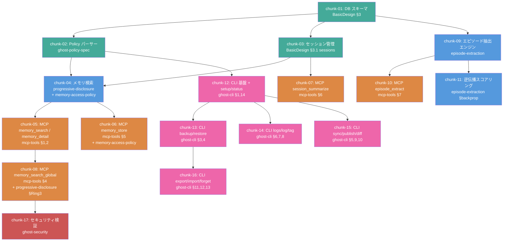

# CDD-Ghost 分割シミュレーション

更新日: 2026-04-12

Builder に 14 本の設計文書（CDD-Ghost 想定）を通した場合のチャンク分割例。基本設計の方針が実例でどう現れるかを示すためのサンプル。

## 依存グラフ



**凡例:** 緑: データ層 / 青: ロジック層 / 橙: MCP層 / 紫: CLI層 / 赤: セキュリティ

## チャンク一覧

| ID | チャンク名 | 参照設計書 | 推定入力 | 依存 |
|----|-----------|-----------|---------|------|
| 01 | DB スキーマ | BasicDesign §3 | ~2.5k | なし |
| 02 | Policy パーサー | ghost-policy-spec | ~3.5k | 01 |
| 03 | セッション管理 | BasicDesign §3.1 | ~2.0k | 01 |
| 04 | メモリ検索コア | progressive-disclosure + memory-access-policy | ~4.0k | 02, 03 |
| 05 | MCP memory_search / detail | mcp-tools §1,2 | ~3.0k | 04 |
| 06 | MCP memory_store | mcp-tools §5 + memory-access-policy | ~2.5k | 04 |
| 07 | MCP session_summarize | mcp-tools §6 | ~2.0k | 03 |
| 08 | MCP memory_search_global | mcp-tools §4 + progressive-disclosure §Ring3 | ~2.5k | 05 |
| 09 | エピソード抽出エンジン | episode-extraction | ~4.0k | 01 |
| 10 | MCP episode_extract | mcp-tools §7 | ~2.0k | 09 |
| 11 | 逆伝播スコアリング | episode-extraction §backprop | ~3.0k | 09 |
| 12 | CLI 基盤 + setup/status | ghost-cli §1,14 | ~3.0k | 02 |
| 13 | CLI backup/restore | ghost-cli §3,4 | ~3.0k | 12 |
| 14 | CLI logs/log/tag | ghost-cli §6,7,8 | ~3.0k | 12 |
| 15 | CLI sync/publish/diff | ghost-cli §5,9,10 | ~3.0k | 12 |
| 16 | CLI export/import/forget | ghost-cli §11,12,13 | ~3.0k | 13 |
| 17 | セキュリティ検証 | ghost-security | ~2.0k | 08 |

## 並列実行レベル

```
Lv.0: [01]
Lv.1: [02, 03]
Lv.2: [04, 09]
Lv.3: [05, 06, 07, 10, 11, 12]
Lv.4: [08, 13, 14, 15]
Lv.5: [16, 17]
```

最大 5 レベル、Lv.3 で 6 並列。Builder が並列実行すれば大幅に短縮可能。

## 関連ドキュメント

- [基本設計](basic-design.md)
- [実行フロー機能設計](2-features/execution-flow.md)
