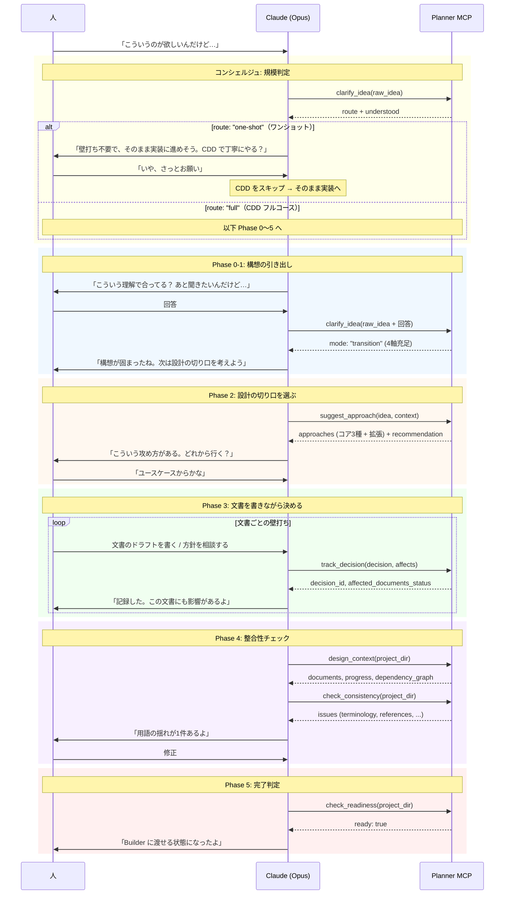

# 壁打ちフロー機能設計書

更新日: 2026-04-11

## 1. 概要

Planner の中核機能である設計壁打ちのフロー全体を定義する。
人の曖昧な構想を Phase 0〜5 で段階的に設計文書に変換し、Builder にハンドオフするまでの流れを規定する。

## 2. 構成要素

### 2.1 バウンダリ（外部との接点）

- **MCP ツール群** — `clarify_idea`, `suggest_approach`, `track_decision`, `design_context`, `check_consistency`, `check_readiness` の 6 ツール
- **設計文書ファイル** — Markdown ファイル群（フロントマター付き）
- **決定ログ** — `decisions.jsonl`

### 2.2 エンティティ（扱うデータ）

- **設計文書メタデータ** — status, layer, decisions, open_questions（フロントマターまたは本文から抽出）
- **決定事項（Decision）** — id, decision, rationale, affects, supersedes, created_at
- **充足度** — 4軸（対象ユーザー / 価値 / スコープ / 制約）の回答状態

### 2.3 コントローラー（主要な処理）

- **規模判定（コンシェルジュ）** — 入力テキストからワンショット / CDD フルコースを振り分ける
- **充足度判定** — 4軸の回答状態を評価し、Phase 遷移を判断する
- **整合性チェック** — 文書間の用語・参照・カバレッジを検証する
- **フォルダ構成検証** — 設計文書標準 §5.1 のフォルダ構成に従っているかを検証する（Builder ハンドオフ前の必須要件）
- **完了判定** — Builder にハンドオフ可能かを総合判定する

## 3. ユースケース

- UC-1/AC-1: 曖昧な構想から設計文書群を作成する（[基本設計 §5](../basic-design.md#5-ai-ghost-shell-での実績) 参照）

## 4. Planner と Builder の接続

```
Planner                          Builder
───────                          ───────
clarify_idea          →（構想の引き出し）
suggest_approach      →（切り口提案）
design_context        →（状況把握）
track_decision        →（決定記録）
check_consistency     →（整合性）
check_readiness       →（完了判定）
                      ↓
              「ready: true」
                      ↓
                                 ┌─ レシピエンジン ─────────────┐
                                 │ analyze_design →（構造分析） │
                                 │ split_chunks   →（分割）     │
                                 │ validate_refs  →（参照検証） │
                                 │ export_recipe  →（レシピ出力）│
                                 └──────────────────────────────┘
                                                ↓
                                          recipe.json
                                                ↓
                                 ┌─ 実行エンジン ──────────────┐
                                 │ load_recipe       →（初期化）│
                                 │ next_chunks       →（次取得）│
                                 │ complete_chunk    →（検証）  │
                                 │ execution_status  →（進捗）  │
                                 └──────────────────────────────┘
                                                ↓
                                        実行アダプタ
                                   （claude-code / local-llm）
                                                ↓
                                        実装コード（テスト済み）
```

Planner の `check_readiness` が `ready: true` を返した時点で、
人に「Builder に渡せる状態になった」と報告する。
Builder に進むかどうかは人が判断する。

Builder は Planner が付与したフロントマター・決定ログ（`decisions.jsonl`）を活用して、
より正確な分割を行う:
- フロントマターの `status`, `layer` → 文書のレイヤー分類・完了状態の判定に使用
- フロントマターの `decisions`, `open_questions` → 依存グラフの補強に使用
- `decisions.jsonl` → 決定事項と影響文書の関係を依存分析に反映

ハンドオフ前提として、Planner はフォルダ構成が設計文書標準 §5.1 に従っていることを `check_readiness` で検証する。
`3-details/` が存在しない等のフォルダ構成違反は、Builder のチャンク化が想定通りに動かない原因になるため blocker 扱い。

## 5. 実行フロー

### 5.1 壁打ちの典型的なフロー



### 5.2 フェーズ間の遷移条件

| 遷移 | 条件 | 判定するツール |
|------|------|--------------|
| 入口→ワンショット | 規模判定でワンショットと判定 + 人が同意 | `clarify_idea` の `route: "one-shot"` |
| 入口→Phase 0 | 規模判定で CDD フルコースと判定、またはワンショット提案を人が却下 | `clarify_idea` の `route: "full"` |
| Phase 0→1 | 4軸（対象ユーザー/価値/スコープ/制約）が全て充足 | `clarify_idea` の `mode: "transition"` |
| Phase 1→2 | 構想が言語化され、設計の入口に立てる | 人の判断 |
| Phase 2→3 | 設計の切り口が決まり、文書を書き始められる | 人の判断 |
| Phase 3→4 | 主要な文書が書き上がった | `design_context` の `overall_progress` |
| Phase 4→5 | 整合性チェックで error がゼロ | `check_consistency` の `status` |
| Phase 5→Builder | `check_readiness` が `ready: true` | `check_readiness` |

### 5.3 各ツールの呼び出しタイミング

```
Phase 0-1  Phase 2         Phase 3          Phase 4         Phase 5
─────────  ──────          ──────           ──────          ──────
clarify    suggest         track_decision   design_context  check_readiness
_idea      _approach       (都度)           check_
(繰返)     (1〜2回)                         consistency
                           design_context   (繰返)
                           (状況確認)
```

- `clarify_idea`: Phase 0-1 で集中的に使う。4軸が埋まるまで繰り返す
- `suggest_approach`: Phase 2 で1〜2回。切り口が決まれば次へ
- `track_decision`: Phase 3 で都度。文書をまたぐ方針変更のたびに記録
- `design_context`: Phase 3-4 で随時。セッション冒頭の状況確認にも使う
- `check_consistency`: Phase 4 で繰り返す。問題がなくなるまで
- `check_readiness`: Phase 5 で1回。Builder ハンドオフの最終判定

### 5.4 人の介入ポイント

人は全ての判断の主体。Planner は支援するが、代替しない。

| タイミング | Planner の役割 | 人の判断 |
|-----------|--------------|---------|
| 構想段階 | 質問で引き出す | アイデアを言葉にする |
| 切り口選択 | 選択肢を提示する | どの切り口から攻めるか決める |
| 壁打ち中 | 決定事項を記録する | 方針を決める |
| 整合性指摘 | 問題を検出する | 修正するか、意図的な差異か判断する |
| 完了判定 | 準備状態を報告する | Builder に進むか、もう少し詰めるか決める |

## 6. 設計判断

### なぜ Phase 0〜1 を最重要とするか

構想の引き出しを飛ばして技術選定や実装に進むと、「そもそも何を作りたかったのか」が定まらないまま設計が進む。AI-Ghost-Shell の実績で、Phase 0〜1 に時間をかけたプロジェクトほど手戻りが少なかった。

### なぜ規模判定（コンシェルジュ）を設けるか

全ての要求に壁打ちフルコースを適用すると、ワンライナー的な要求で過剰なプロセスになる。コンシェルジュで振り分けることで、CDD のプロセスを軽量に保つ。

## 7. 検証方針

- フェーズ遷移条件が正しく機能するか（充足度判定、整合性チェック）
- Builder ハンドオフ後に設計と実装の乖離が発生しないか（ラウンドトリップ検証）

## 関連ドキュメント

- [基本設計](../basic-design.md)
- [MCP ツール詳細設計](../3-details/mcp-tools.md)
